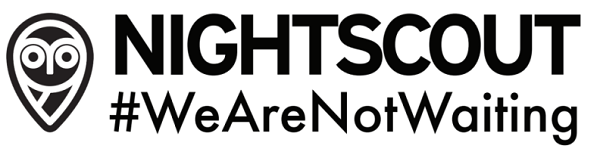
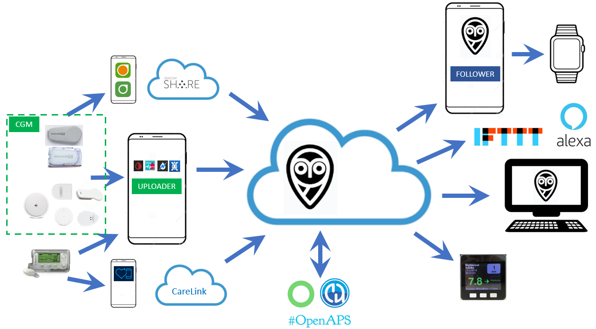
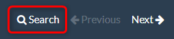

# Welcome to Nightscout

 
 
 

## Introduction

**Nightscout** (also known as **"CGM in the Cloud"**) is an open-source cloud
application **used by people with diabetes and parents of kids with diabetes** to visualize, store and share the
data from their **Continuous Glucose Monitoring** sensors in real-time. Once
setup, Nightscout acts as a central repository of blood glucose and insulin
dosing/treatment data for a single person, allowing you to view the CGM graph
and treatment data anywhere using just a web browser connected to the internet.

There are several parts to this system. You need somewhere online to
store/process/visualize this data (**a Nightscout Site**), something to upload
CGM data to your Nightscout (**an Uploader**), and then optionally you can use
other devices to access/view this data (**one - or more - Follower**):

#### Nightscout Site

The Nightscout cloud application can be installed by yourself using hosting
services from various cloud service providers.

Although not necessary, you might prefer to use paid hosting services for your database (to avoid future maintenance tasks) or indeed pay to use a fully-managed Nightscout hosting service to avoid having to personally build and maintain your site yourself.

#### Uploader

The CGM data is usually sent to Nightscout by an **uploader device** (often
known as an **"Uploader"**) such as a mobile/cellphone running an app such as xDrip+, Spike, xDrip4iOS or Medtronic Uploader. Alternatively, the CGM data can be pulled directly from your online Dexcom or Medtronic CareLink accounts. The application you'll need for uploading the data depends on which CGM device you're using and what type of mobile device you have. Once you've read this page (yes - all the way to the bottom!), you can find more information here about [Uploaders](./uploader/uploaders.md).

#### Followers

In addition to viewing the data using a web browser, there are also
applications available for mobile devices, smartwatches, electronic devices and
other cloud-based services which allow you alternative ways to view and
interact with the information stored within your Nightscout site (often known
as **"Followers"**).

 
## Development History

Nightscout was developed by people with Type 1 Diabetes and parents of kids with T1D and has
continued to be developed, maintained, and supported by volunteers, clinical
use, and commercial sponsorship. The web portal known as Nightscout is made by the [CGM
Remote Monitor
Contributors](https://github.com/nightscout/cgm-remote-monitor/graphs/contributors)
and the Nightscout community over years.

When first implemented, Nightscout was a solution specifically for remote monitoring of Dexcom G4 CGM data. Today, there are Nightscout solutions available for nearly all commercial CGM sensors. The goal of the project is to allow the remote monitoring, sharing and analysis of any T1D's glucose levels using existing monitoring devices.
 

## What are the values of Nightscout

We are compelled in the pursuit of **humane** and **equitable** application of
technology to **liberating people from the burden of diabetes**.  We are not
waiting to deliver the benefits we've found in **sharing _all_ diabetes
experiences**.  Nightscout is free to contribute, free to access, free to
criticize, free to try, free to depend on, free to modify, and free to
distribute.  The Nightscout community demands **respect** and **dignity** for all
community members.  The reputation of the Nightscout community is affected by
the **quality** of the source code, the quality of our relationships, the
quality of our discussions, what we are known for doing: the way we treat each other.
Users of Nightscout are impacted by **reliability**, **security** and
**confidentiality** of
Nightscout.  Therefore, the developers and contributors of Nightscout strive to
improve the quality of Nightscout while making these opportunities
**accessible** to all.

Nightscout's **longevity**, the application, the ecosystem, and the culture demand
we use all tools at our disposable to achieve the values in a **sustainable** way.
We are not waiting to do whatever it takes to meet the needs of people affected
by the inhumane demands of diabetes.  Our active **collaboration** against the
burden of diabetes creates the results we desire.

 

## What Do I Need?

You really don't need too much to get Nightscout up and running but let's start with the basics.

Are you sitting comfortably? Then let's begin.

You will need:

-   A CGM sensor: Dexcom, Medtronic, Libre (plus an additional transmitter) or Eversense

-   A way to [upload](./uploader/uploaders.md) your data (this is generally an internet-connected mobile phone with a matching uploader app)

-   Internet access

-   1 hour of "quiet" time (a <s>beer</s> nice cup of coffee is optional but highly recommended)

-   Basic computer skills and the ability to ***carefully*** follow the installation guides shown on this site 

    ***"Carefully"** means that you will thoroughly read, follow and complete each step without skipping any and without giving up thinking that it is too difficult - it isn't, you just need to be patient.*

 
!!!warning "IMPORTANT"
    Before using Nightscout, it is important to understand that this project:

    - is an open-source, community-based project and is not supported by any company
    - is not officially approved or regulated for diabetes therapy and/or treatment in any way
    
    **You must understand that you take full responsibility for building and running this system and you agree to do so at your own risk.**

!!!warning "SAFETY"
    - This project requires a working internet connection and availability of third-party cloud services
        - Do not rely only on Nightscout as the only way you have of knowing your blood glucose values and trends
        - Make sure you're ready to cope with an unexpected failure and always have alternative ways to check your blood glucose levels

 

## How Much Does It Cost?

It is possible to run Nightscout for free. Classic DIY Nightscout requires free accounts at three companies: GitHub, MongoDB, and Heroku. All three of which will demand some sort of maintenance and will generate sales and warning emails over the course of the years. DIY Nightscout is unfortunately not set it and forget it and will require upgrades and even platform changes to follow software evolutions or policies of the companies used when you created your site.

Free databases like the Atlas M0 Sandbox provided by [MongoDB](https://www.mongodb.com/) will hold a limited amount of data (512MB) and you may eventually need to delete old records (maybe every 3-4 years with standard Nightscout CGM usage). You can increase even further the database capacity to 2GB/5GB ($9/$25 USD/month) by paying for an M2/M5 Shared Cluster if you wish.

Application servers such as [Heroku](https://www.heroku.com/)'s "Free" plan will provide enough server hours to run a single Nightscout site without any
downtime. If you need to run several sites on the same account, have "never sleeping" apps, you can easily upgrade to a paid "Hobby" plan ($7 per dyno per month).

 

## Nightscout as a Service

If you prefer to pay and just use Nightscout as a fully managed service and let somebody else worry about installation and maintenance then [T1Pal](https://t1pal.com/) could be exactly what you need.

 
   The developers recommend paid support for high quality, reliable service.
The developers recommend [T1Pal](https://t1pal.com) in order to augment the sustainability of the
Nightscout Project. The monthly subscription for T1Pal is $11.99 USD/month.

 

The T1Pal hosting service has been developed by **Ben West**, a member of the original CGM in the Cloud team and an original lead core developer for the Nightscout Project.

Database and server administration is automated and managed automatically as
part of the service.
Contact T1Pal support to request specific features or versions.
File a support ticket by emailing ***support*** at ***t1pal.com***, or select "Get
Support" from [My Account](https://www.t1pal.com/account/).

 

[ns.10BE.de](https://ns.10be.de/) was started in Nov 2017 and offers full managed Nightscout Services. You can create Nightscout with a few clicks and won't have to worry about maintenance, updates, database space and CPU limits.

The servers are located in different fail-safe data centers in Germany, Finland or France (can be selected) . They are monitored by [uptimerobot](https://ns.10be.de/en/status.html) and own Slackbot. When a server goes down, it restarts itself and sends a twitter message.
 

***It is 10BE for free?***

Not anymore, because the costs were simply not covered by the donations.

A Nightscout Instance will cost €4.99/month, with discounts when increasing subscription duration.

A backup of your database and settings is performed every 6-8 hours.
You can import data from your old Nightscout instance or MongoDB database, also upload data (Freestyle, Dexcom, Omnipod, ...) via CSV files.

To see more about NS10 features and costs, take a look at the [features page](https://10be.de/en/pricing.html). The registration is free.

***Support:*** support @ ns.10be.de or [https://10be.de/en/contact.html](https://10be.de/en/contact.html) or [https://twitter.com/10be_de](https://twitter.com/10be_de) or [https://www.facebook.com/10be.de](https://www.facebook.com/10be.de)

 

## Who Can Help Me?

You will find many willing and open-hearted people in the Facebook groups. 

The main group for all Nightscout support is the "[CGM in the Cloud](https://www.facebook.com/groups/cgminthecloud/)" Facebook group.

There are also many local Nightscout communities and you'll probably be able to find one in your own country and language if this helps.

!!!warning "Technical Support"
    This project is often considered "**Do It Yourself**" (DIY) and supported by volunteers. Whilst you will almost certainly always will find someone ready to help you for free, building your own Nightscout site **doesn't entitle you to any form of support** from anybody.
    

    The open-source diabetes movement is founded on the idea of **paying it forward** and helping others to learn things that others took their time to help teach you about.
    
    *Ask nicely, and nice people will always do nice things and help you.*
    
    Nightscout developers are busy people and we'd like them to concentrate on maintaining and improving Nightscout, not only supporting users. (This means **do not** send them private messages or friend requests just to help fix something that is already clearly documented or for help that can be easily requested in the CGM in the Cloud group)

!!!info "Facebook Privacy"
    You'll find a lot of useful and friendly diabetes-oriented groups on Facebook and it's probably the best place to find online support. Some people express concerns about using Facebook: if you're worried about your privacy just remember Facebook will only share the information that you **allow** it to share.

 

## How to Use These Docs

* Use the navigation menu at the top of the screen to find the section that you are looking for.

* A Table of Contents for the current page is always displayed on the left side of the screen.

* You can search the Nightscout Docs site by clicking the Search icon at the top of every page:

     

 

## How Can I Help?

You'll find the source repository for this documentation [here](https://github.com/nightscout/nightscout.github.io). Please don't hesitate to improve or correct anything you see and create a pull request!

You're also welcome to contribute or report any error, unclear explanation, typo, broken link etc by going to Github and opening an [issue](https://github.com/nightscout/nightscout.github.io/issues).

Finally, to help on the development of Nightscout itself, feel free to join in at our [Discord Channel](https://discord.gg/zg7CvCQ).
