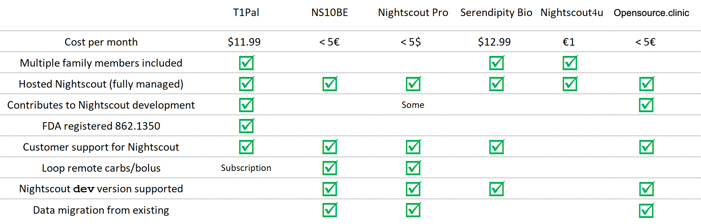
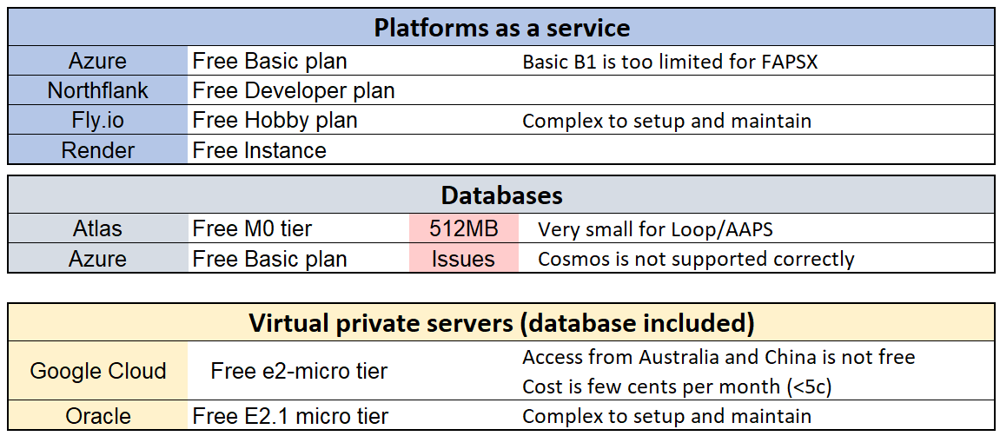

# New Nightscout Users

<span style="font-size:larger;">*"What is great is there will be multiple options for those interested in setting up the system! #wearenotwaiting" J.A.*</span></span>

```{admonition} Too complicated? Not what you're looking for?
:class: seealso
Consider a hosted Nightscout service! Check for easier solutions [here](project:/index.md#nightscout-as-a-service).
```

```{admonition} Confusing?
:class: hint
**[Need help to choose?
Try the wizard](wizard)**.

```

## Basic concepts

Even if knowing how it works is not mandatory, it is very useful to understand a few background concepts before starting DIY Nightscout.

1. The **code** available open source in [GitHub](https://github.com/nightscout/cgm-remote-monitor) or packaged for you in [Docker](https://hub.docker.com/u/nightscout) is the set of instruction that will be used to make your Nightscout. You don't need to understand it or be a programmer to use it.
2. Your Nightscout will usually be running a **web application** in the internet cloud, meaning that somewhere on the planet, a computer or another will spend some of its time to keep your Nightscout active. This is the engine of Nightscout: it will make sure to be ready to accept the data you will send to it (BG, treatments, ...) or to answer to data requests when you ask them (BG, reports, ...) and even send alarms when instructed to do so. You will not see the engine work but you will see its frontpage: the web URL of your Nightscout site, which will be available on any device connected to the internet.
3. Since you will need to store a lot of data, Nightscout must have a **database**. This database will also be in the cloud, meaning data will be stored on one or more computers, somewhere. The Nightscout engine mentioned above will store and read data from this database whenever required.


**From this you understand there are three main pieces necessary to build your Nightscout:**

1. **The Nightscout code also known as cgm-remote-monitor**
2. **A cloud platform running the Nightscout web app**
3. **A cloud database storing Nightscout data**

Some platforms offer both engine and database like Azure, Railway, Northflank and all VPS servers. But you can use an external database if you want. Some others like Heroku or Fly.io don't propose a database and require you to use an external one. Traditionally the database holding Nightscout data is hosted by another provider (mLab, now MongoDB Atlas) but it might not be the most reliable solution.

</br>  

## Building Nightscout DIY in a cloud platform

You can run your Nightscout site in several vendors platforms, using free or paid accounts.  Try the [wizard](wizard) to see which options can match your needs.

Below is a list of most used platforms. There are probably others, don't hesitate to [open an issue in the documentation](https://github.com/nightscout/nightscout.github.io/issues) with the easiest deployment method if you want to see them named here.

</br>

## Vendors comparison table

```{note}
Hosted services include everything: platform, database and support.
```

[T1Pal](https://t1pal.com/), [NS10BE](https://ns.10be.de/de/index.html), [Nightscout Pro](https://nightscout.pro/), [Serendipity Bio](https://serendipitybio.com/), [Nightscout4u](https://www.nightscout4u.com/)



</br>

## Free DIY

These are the current solutions not involving, or limiting to a strict minimum, costs.  

```{note}
Most vendors will require a credit card to authenticate users and avoid abuse.
```

[Azure](/vendors/azure/new_user), [Northflank](/vendors/northflank/new_user), [Fly.io](/vendors/fly.io/new_user), [Render](/vendors/render/new_user), [Atlas](/vendors/mongodb/atlas), [Google Cloud](/vendors/google/new_user), [Oracle](https://www.dropbox.com/s/5twlqrndofqno0t/0-amber-oracle.pdf)



</br>

## Paid DIY

These solutions require a monthly fee.

```{note}
Paying for a platform doesn't imply your database is included and covered by the plan.
```

[Heroku](/vendors/heroku/new_user), [Railway](/vendors/railway/new_user) with [database](/vendors/railway/database), [Northflank database](/vendors/northflank/database) or [NAS](nas)


</br>

## Security and safekeeping


- Do not use the same password for all your accounts, and choose passwords that are not easy to guess.
- Do not use the `API_SECRET` for the Atlas database password.
- Do not use your Dexcom or CareLink user name or password for Nightscout components.
- Do not share the `API_SECRET` or other passwords of your accounts to others.
- Do not use Nightscout or any related applications on rooted and/or otherwise compromised devices, and ensure you always have the latest operating system and virus protection updates installed.

If you want to read more about Nightscout security, including about additional configuration options to make your installation more secure, please check our [security guide](/nightscout/security.md).

</br>
