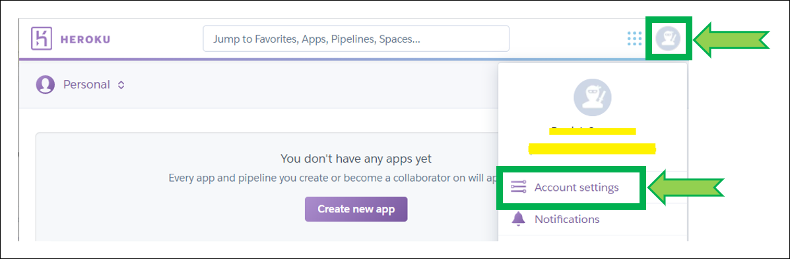

# Heroku Troubleshooting

 

### There's nothing here

If you didn't upgrade Heroku to a hobby plan [migrate to Railway](../../../vendors/railway/migrate).

If you just tried to deploy a new Nightscout site, something went wrong. Cleanup your Heroku apps and retry...

 

### Application Error

 [Update Nightscout to latest release](../update/update.md). It might not fix your issue but it will help find a solution.

- If you didn't migrate your Heroku database from mLab to Atlas [create a new Atlas database](../../update/newdatabase/).
- If you didn't migrate from Azure to Heroku create a new site [create a new Nightscout site](../../nightscout/new_user/).
- If you're creating a new Nightscout site, it might have failed because of a [wrong connection string](../atlas/#unable-to-connect-to-mongo).

- If you don't see any good reason [restart all dynos](#restart-all-dynos) if you have Heroku or check you app state in Railway [dashboard](https://railway/dashboard).

- Check your MongoDB Atlas [database is not full](../atlas/#database-full).

 

### A valid GitHub Directory could not be found.

When trying to deploy a new Nightscout site, this message appears when clicking `Deploy to Heroku`.

- Change browser and retry.

 

### Cannot find cgm-remote-monitor in Heroku / No GitHub source visible

When updating Nightscout, `cgm-remote-monitor` doesn't appear automatically in Heroku under your repository name.

When updating Nightscout, your repository name doesn't appear in `Manual Deploy` so that you can't select the `master` branch.

- `Disconnect` and re-`Connect` like this:

- If it doesn't help try to re-authorize as explained below:

 

### Cannot find cgm-remote-monitor in Heroku: Item cannot be retrieved

When updating Nightscout, `cgm-remote-monitor` doesn't appear automatically in Heroku under your repository name and an error message appears when you try to connect to GitHub.

- In Heroku, go to `Account Settings`

- Select `Applications` and click `Re-authorize`

- Click `Authorize GitHub` in the pop-up.
- If it doesn't help, you can also try to `Revoke access`... before going back to Re-`Connect` your GitHub account. This is necessary if someone else did setup Nightscout for you and left his own GitHub connected to your Heroku account.

 

### I can't log into Heroku

If you lost your password use the [password reset option](https://id.heroku.com/account/password/reset).

If you lost your authenticator use the recovery codes (that you hopefully saved when [securing your account)](../../vendors/heroku/).

If you lost or don't have anymore access to the email you used to create your Heroku account you will need to deploy a new Nightscout site. You can use the same GitHub account and the same MongodB Atlas database you currently have but will have to use another Nightscout site name in Heroku as the current one is already in use. First [recover your connection string](../atlas/#recover-your-connection-string), and proceed to [creating a new Nightscout](../../vendors/heroku/new_user/) **skipping Step 3**.

 

### Restart all dynos

- Log in Heroku, go to `Settings`, `More`, `Restart all dynos`.

 

### Nightscout stopped working after a few weeks

Same screen than above but you received a mail from Heroku telling you you're out of dyno hours...

- Check your remaining dyno hours in Heroku, click on your profile picture top right and select `Account Settings`, then `Billing`.

- An account without credit card information has 550 [free dyno hours](https://devcenter.heroku.com/articles/free-dyno-hours#usage), with credit card information 1000.

 

- An account with credit card information can only hold one Nightscout site. You need one account per site, and you can simplify multiple sites management as explained [here](../../nightscout/multiadmin/).
- If Heroku runs out of free dynos, check you don't have other deployments wasting your free dyno hours and eventually [cleanup or stop unused apps](../cleanup/#heroku).

 

## Cleanup

If you experience issues during deployment you might end up with many apps. Make sure you keep the last one that was functional or delete all before attempting a new deployment. This will just make it easier to find which app you're trying to build. Keeping sleeping apps doesn't have any negative impact but no real advantage unless you do it on purpose.

Make sure the app you're using for Nightscout is running on a Hobby tier.

If you're not convinced you want to delete an app, make sure to put it in maintenance mode to understand if you use it as the related Nightscout site will report offline for maintenance.

 

### Maintenance mode

Maintenance mode is useful to troubleshoot Dexcom and CareLink accounts locked and also if you need to modify several variables without having Nightscout restarting every change.

You can also put your Nightscout in maintenance mode if you won't use it for an extended period of time.

Be aware that your MongoDB Atlas database might also go in sleep mode and you will need to [restart it manually](../atlas/#mongodb-paused).

 

### Delete an app

Deleting an Heroku app does **not** delete your Nightscout data, but you might want to write down your variables (definitely backup your connection string) if your site was functional before. Note that you can also rename an app (unless the name is already in use in heroku.com).

To delete an app, select it and go to `Settings`, scroll down to `Delete App`

Copy and paste your app name to confirm deletion, 

