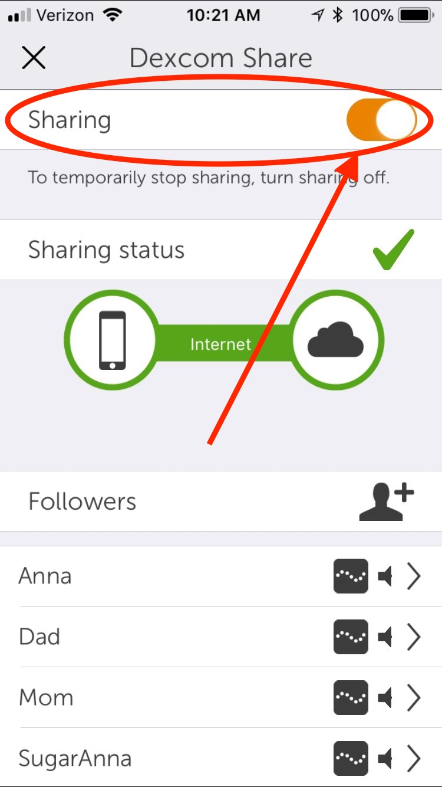

## Overall third party services

 

**APPLIES TO:**	DIY Nightscout

For [Nightscout as a service](../../index#nightscout-as-a-service) contact directly ***support*** at ***t1pal.com*** or use the `Get Support` links.

 

### Before troubleshooting

 

Check the services you're using.

Dexcom: [https://status.dexcom.com/](https://status.dexcom.com/)

Carelink US: [https://carelink.minimed.com/](https://carelink.minimed.com/)

Carelink non-US: [https://carelink.minimed.eu/app/login](https://carelink.minimed.eu/app/login)

GitHub: [https://www.githubstatus.com/](https://www.githubstatus.com/)

Heroku: [https://status.heroku.com/](https://status.heroku.com/)

Atlas: [https://status.cloud.mongodb.com/](https://status.cloud.mongodb.com/)

 

## GitHub and Heroku

 

### A valid GitHub Directory could not be found.

 

When trying to deploy a new Nightscout site, this message appears when clicking `Deploy to Heroku`.

- Change browser and retry.

 

### I lost access to my GitHub

Create a new account and fork cgm-remote monitor as described [here](../../nightscout/new_user/#step-1-create-a-github-account).

**Follow only Step 1.**

You can now upgrade or redeploy your Nightscout using redeploy as explained [here](../../update/redeploy/#step-1-cleanup-github).  You won't have to delete the existing repository since it's not there for the moment. Go down to Fork cgm-remote-monitor in the explanation.

 

### Cannot find cgm-remote-monitor in Heroku / No GitHub source visible

 

When updating Nightscout, `cgm-remote-monitor` doesn't appear automatically in Heroku under your repository name.

When updating Nightscout, your repository name doesn't appear in `Manual Deploy` so that you can't select the `master` branch.

- `Disconnect` and re-`Connect` like this:

- If it doesn't help try to re-authorize as explained below:

 

### Cannot find cgm-remote-monitor in Heroku: Item cannot be retrieved

 

When updating Nightscout, `cgm-remote-monitor` doesn't appear automatically in Heroku under your repository name and an error message appears when you try to connect to GitHub.

- In Heroku, go to `Account Settings`

- Select `Applications` and click `Re-authorize`

- Click `Authorize GitHub` in the pop-up.
- If it doesn't help, you can also try to `Revoke access`... before going back to Re-`Connect` your GitHub account. This is necessary if someone else did setup Nightscout for you and left his own GitHub connected to your Heroku account.

 

### I can't log into Heroku

If you lost your password use the [password reset option](https://id.heroku.com/account/password/reset).

If you lost your authenticator use the recovery codes (that you hopefully saved when [securing your account)](../../vendors/heroku/).

If you lost or don't have anymore access to the email you used to create your Heroku account you will need to deploy a new Nightscout site. You can use the same GitHub account and the same MongodB Atlas database you currently have but will have to use another Nightscout site name in Heroku as the current one is already in use. First [recover your connection string](../../troubleshoot/connection_string/#recover-your-connection-string), and proceed to [creating a new Nightscout](../../nightscout/new_user/) **skipping Step 3**.

 

# Atlas

### Limit of one free cluster.

 

When creating a new site or migrating (usually not the first attempt), when reaching `Target Cluster`.

- Click the leaf top left in your Atlas account. Look at the `Project Name` you wanted to use when creating your new cluster, it shouldn't contain a cluster yet (like the example below, I tried to create a new Nightscout site but there is already a cluster inside the project I wanted to use). You can't have two clusters in a free project. Click your `Project Name`.
- This should not happen in normal conditions. Before deleting a cluster, check it doesn't contain your data!

- Click on `Collections` in the cluster you selected.

- Click on `entries`

- In the case there is data, like in the example below, **don't use this cluster**. Leave it like this and create a new one.

- **If there no data**, you can safely delete it.

- In this cluster you want to delete click `...` then `Terminate`

- Copy the cluster name to confirm then click `Terminate`

- Wait until the operation completes.
- You can now use this project name to create a new site.

 

# Nightscout page doesn't open

### Application Error

 

 [Update Nightscout to latest release](../update/update.md). It might not fix your issue but it will help find a solution.

- If you didn't migrate your Heroku database from mLab to Atlas [create a new Atlas database](../../update/newdatabase/).
- If you didn't migrate from Azure to Heroku create a new site [create a new Nightscout site with Heroku](../../nightscout/new_user/).
- If you're creating a new Nightscout site, it might have failed because of a wrong connection string. Delete your Heroku app and [deploy](../../nightscout/new_user/#step-4-fork-and-deploy-cgm-remote-monitor) again after [checking](../connection_string/#change-your-atlas-database-password) the Atlas connection string is correct.

- If you don't see any good reason just go ahead:

 

## Restart all dynos

- Log in Heroku, go to `Settings`, `More`, `Restart all dynos`.

 

### Nightscout stopped working after a few weeks

 

Same screen than above but you received a mail from Heroku telling you you're out of dyno hours...

- Check your remaining dyno hours in Heroku, click on your profile picture top right and select `Account Settings`, then `Billing`.

- An account without credit card information has 550 [free dyno hours](https://devcenter.heroku.com/articles/free-dyno-hours#usage), with credit card information 1000.

 

- An account with credit card information can only hold one Nightscout site. You need one account per site, and you can simplify multiple sites management as explained [here](../../nightscout/multiadmin/).
- If Heroku runs out of free dynos, check you don't have other deployments wasting your free dyno hours and eventually [cleanup or stop unused apps](../cleanup/#heroku).

 

## Boot Error - Unable to connect to Mongo

 

Look at this [dedicated page](./connection_string.md).

 

# No data in Nightscout

Make sure your Nightscout [time zone](../../nightscout/profile_editor/) is correct.

 

### Dexcom data not showing

 

#### Dexcom Share

Make sure you have Dexcom Share turned ON in your Dexcom app. In the Dexcom app's main screen, find the triangle made of dots. If the dots are grey, you do not have Share turned on. Tap the triangle, and follow the directions to add a follower (yourself if you don't have someone else you'd like to invite) and turn on Share.

 

If you are using a Dexcom system, and your data is not appearing in Nightscout, there are only a limited number of reasons for that. You should check your (1) Heroku settings and (2) Dexcom Share.

NOTE: The #1 reason why BGs aren't showing is that you have mismatched password and user names in Heroku settings and Dexcom.

#### Heroku Settings

Login to your [Heroku](https://www.heroku.com/) account and from within Heroku `Settings`, click on the  `Reveal Config Vars`

 

Now from the `Config Vars` area, check the following (see screenshot below for reference):

1. You must use the same `BRIDGE_PASSWORD` or `BRIDGE_USER_NAME` that your Dexcom mobile app is using.
2. You must have `bridge` and `careportal` on the `ENABLE` line (you can have other values there...but don't forget these two).
3. If you are outside the USA, you must add `BRIDGE_SERVER` set to `EU` in Heroku settings.
4. Your `careportal` must be one word in the `ENABLE` line, sometimes autocorrect makes it two words.
5. If using `mmol`, make sure you have spelled that value correctly in the `DISPLAY_UNITS`.

 

##### Authentication errors

One thing that can happen if you have an incorrect Dexcom login/password in your Share account settings and/or in your Nightscout `BRIDGE` settings is that Dexcom will lock your account...and you won't see CGM data in Nightscout. If you notice your CGM readings disappeared, but everything else is flowing...check your Heroku logs that are viewable by selecting "View Logs" from the drop-down menu underneath the "More" option. 

 

Do your logs have "`SSO authentication errors`" like in the red box highlighted above? If you do, then:

1. Delete your `BRIDGE` entries within Heroku settings.  Don't delete the variables, just delete the values of `BRIDGE_PASSWORD` and `BRIDGE_USER_NAME`.
3. Wait 15 minutes and then follow the directions below. It is important to wait 15 minutes: the reason you can't log in right now is that your Dexcom account has a temporary lock from the passwords in the step above being incorrect. The temporary lock will expire after 10-15 minutes of giving the account login a break from the incorrect logins. So, definitely wait or else you'll just keep prolonging the issue.

When you change these variables, Heroku restarts Nightscout. So now everything should work.

!!!info "About your Bridge password and user name"
    The most common error on initial Nightscout setups is that people incorrectly use an old account or an old password. To test your username and password, go to Dexcom's Clarity page (check [here for USA accounts](https://clarity.dexcom.com) and [here for the others](https://clarity.dexcom.eu)) and try logging in to your Dexcom account. If your account info isn't valid, or you don't see any data in your Clarity account... you need to figure out your actual credentials before moving ahead. See [**here**](../../troubleshoot/dexcom_bridge/) for troubleshooting tips and information on your Dexcom account.
    

### Dexcom username issue

!!! note
    New Dexcom users are not being assigned a username anymore but need to log with their email address. If you don't have a username, you should be able to use `bridge` with an email address, make sure you [update Nightscout to the latest release](../../update/update/).

 

### Dexcom or CareLink data stopping after a while

!!!Note
    CareLink with mmconnect data source stopped functioning for most . **Remove the `mmconnect` plugin from `ENABLE` if you use Heroku**.

  

First verify you can see your BG in Clarity.

If data is present open Heroku and check you app didn't fall asleep.

 

A sleeping app might be due to your Heroku free plan: a Hobby plan makes the app never sleep. [https://www.heroku.com/pricing](https://www.heroku.com/pricing) 

Another reason for a sleeping app can be due to a failure to obtain data from Dexcom Share, check the logs to understand the reasons.

 

!!!Warning "UpTime Robot"
    Using an uptime robot with a bad password, or other issues originating from Nightscout can lead to a locked account ([Dexcom](../dexcom_bridge/#account-lock)) or Heroku addresses ban. This is not a recommended solution as it might generate a global Heroku IP blacklist lock that could propagate to all other users. If you use Nightscout, uploading data in the cloud or even just having a browser or an app downloading data should be enough to keep your app awake.

 

### Error code instead of a BG value

 

Nightscout implements Dexcom error codes as listed below:

| Code  | Corresponding error   |
| ----- | --------------------- |
| `?SN` | Sensor not active     |
| `?MD` | Minimal deviation     |
| `?NA` | No antenna            |
| `?NC` | Sensor not calibrated |
| `?CD` | Counts deviation      |
| `?AD` | Absolute deviation    |
| `???` | Power deviation       |
| `?RF` | Bad RF                |

 

# Data timing issues

### Basal is shifted in time

- Check the time zone is correct for your currently active profile in your Nightscout [`Profile editor`](../../nightscout/profile_editor/).

 

### Data in the future

- Check you don't have data in the future with the `Admin tools`. Remove them if existing.

 

- If this isn't working, or shows no future data, check in [Atlas](https://account.mongodb.com/account/login)
- Open your Nightscout cluster and select `Collections`

 

- In `Entries` type `{date:-1}` and click `Find`

 

- Delete the entries in the future (manually) with the bin icon

 

### Basal / IOB / COB missing after DST

- Setup again your time zone in [profile editor](../../nightscout/profile_editor/) (authenticate and save).

 

# Database full

 

Free databases like M0 Sandbox provided by Atlas will only hold a limited amount of data (512MB) and you will eventually need to manually cleanup. You can extend the capacity to 2 and 5GB paying an M2 or M5 Shared cluster.

- Make sure your Nightscout site has `Database Size` enabled to monitor database capacity. Look [here](../../nightscout/setup_variables/#dbsize-database-size) for more information on this plugin.

 

- Check in [Atlas](https://account.mongodb.com/account/login)
- Open your Nightscout cluster and select `Collections`

 

- Click your database name (hidden left). Check the`DATABASE SIZE` is indeed close to or at the limit then look at these three collections `Documents size`: `devicestatus`, `entries` and `treatments`.

- Open Nightscout  `Admin tools`.
- Depending on the collection you identified above, choose which of the following you want to cleanup:

##### Cleanup:

You can cleanup (enter the number of days to keep) or delete your devices status:

Same for `Treatments`:

And `Glucose entries`. If you are reluctant to lose historical data you should consider opting for a paid database solution.

 

# Reports slow loading or timeout

Loopers might experience Nightscout taking an extremely long time or even timing out when creating reports due to the profiles collection database growing too big.

Two solutions are available:

1. Follow this video (set it full screen in 720p) to selectively delete profiles [https://www.youtube.com/watch?v=iipp0MfPKNQ](https://www.youtube.com/watch?v=iipp0MfPKNQ)
2. Delete all profiles in Atlas

Log in to Atlas [https://account.mongodb.com/account/login](https://account.mongodb.com/account/login)

Select your cluster then `COLLECTIONS`

 

Select the `profile` collection and click the bin icon to delete all profiles.

 

Write `profile` in the box then click `Drop`

 

Open your Nightscout and create a new profile (mind the time zone!), authenticate and save it.

If you are using Loop, temporarily change a basal rate in Loop, and confirm your profiles now show up in Nightscout.