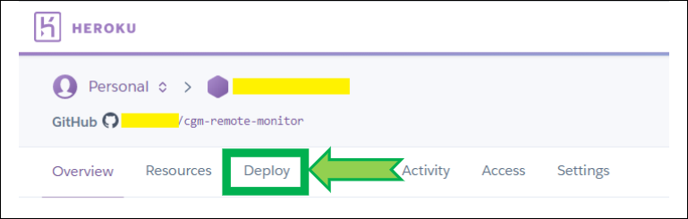
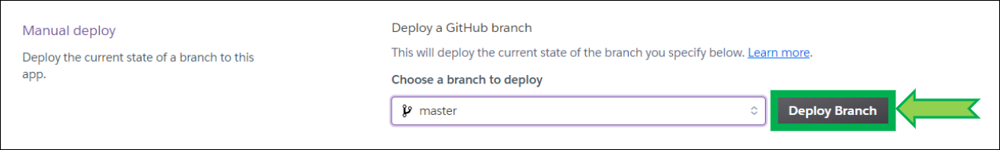

# Updating the Heroku stack

**APPLIES TO:**	

------

 

It is good practice to maintain your Heroku stack up to date. Either when you receive an email from Heroku or when you [update your Nightscout site](../update) (which is also a good habit).

 

- Log in Heroku [https://id.heroku.com/login](https://id.heroku.com/login)

!!! note
    Salesforce requires two-factor-authentication for more Heroku security, this is mandatory starting Feb 2022. For an overview of possible methods see [here](../../vendors/heroku).

 

 

- Select your app

 

- Click `Settings`

 

- If present select `Upgrade Stack`

 

- `Confirm` the upgrade

 

- Now you need to deploy to upgrade the stack

 

- Click on `Deploy`

 

- Scroll down to the bottom of the page, select the `master` branch and click `Deploy Branch`

*Note: if you can't select the `master` branch or `Deploy Branch` doesn't do anything [update your Nightscout site](../update).*

 

- Build will start and information will scroll in the log window. Do not leave the page, do not interfere and wait for completion. It might take more than 10 minutes. Interrupting the process will lead to a broken site and you'll need to restart deployment.

 

- Wait until the deploy process completes and click `View` (if nothing happens click `Manage App` then upper right `Open App`)

 

You have upgraded your Heroku stack.