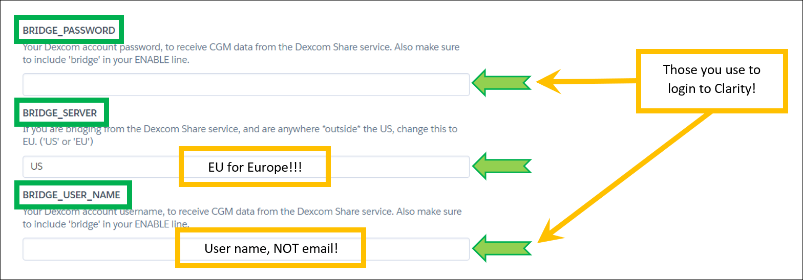
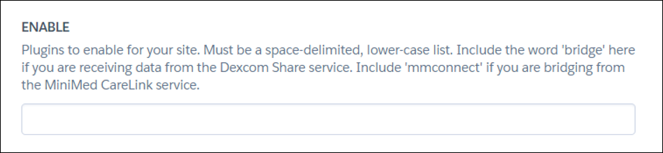

# Uploaders setup

</br>

!!! note
    You usually should express the Nightscout URL in secure **https://**, not only http://.  (Unless you set `INSECURE_USE_HTTP` to `true`)

------

<span style="font-size:smaller;">**APPLIES TO:**</span>	

Your `Nightscout URL` defined in Heroku by your App name, is the one that shows when you open your Nightscout site in a browser. It usually looks like: `https://yoursitename.herokuapp.com`


Your Nightscout password, is the `API_SECRET` variable you can find editing your Heroku variables like [this](../../../vendors/heroku/new_user/#editing-config-vars-in-heroku).

------

<span style="font-size:smaller;">**APPLIES TO:**</span>	

Your `Nightscout URL` defined in Railway by your Web app name, as shown in your [Dashboard](https://railway.app/dashboard). It usually looks like: `https://yoursitename.up.railway.app`


Your Nightscout password, is the `API_SECRET` variable you can find editing your Railway variables like [this](../../../vendors/railway/new_user/#editing-variables-in-railway).

------

<span style="font-size:smaller;">**APPLIES TO:**</span>	

You will find the `Uploader url` and `Api Secret` required to configure your uploader [here](https://www.t1pal.com/account/sites/my#Uploaders).

------

</br>

## Dexcom

You need at least one follower to use Dexcom Share.

!!!note  
    If you use a DIY closed loop system it is recommended that you let it upload to Nightscout instead of importing data using Dexcom Share and the `bridge` plugin.

On your master phone, touch the Share icon, enable Sharing. If you have no follower, add one. You can also invite yourself.


</br>

Verify, update or add these variables:

`BRIDGE_USER_NAME  
BRIDGE_PASSWORD  
BRIDGE_SERVER`

[Edit in Heroku](../../vendors/heroku/new_user/#editing-config-vars-in-heroku):



Or [edit in Railway](../../vendors/railway/new_user/#editing-variables-in-railway).

</br>

You need to add `bridge` in the `ENABLE` variable. Do not delete other entries, just add `bridge` after a space.



</br>

!!!info "MOST COMMON ERRORS"
    The most common error on initial Nightscout setups is that people incorrectly use an old account or an old password. To test your username and password, go to Dexcom's Clarity page (check [here for USA accounts](https://clarity.dexcom.com) and [here for the others](https://clarity.dexcom.eu)) and try logging in to your Dexcom account. If your account info isn't valid, or you don't see any data in your Clarity account... you need to figure out your actual credentials before moving ahead. See [here](../../troubleshoot/dexcom_bridge/) for troubleshooting tips and information on your Dexcom account.

!!! note "Password"
    *Some people have had problems with their bridge connecting when their Dexcom passwords are entirely numeric. If you have connection issues in that case, try changing your password to something with a mix of numbers and letters.*

</br>

------

<span style="font-size:smaller;">**APPLIES TO:**</span>	

For hosted Nightscout put your Dexcom credentials [in Dexcom Bridge](https://www.t1pal.com/account/sites/my#DataIngress).

------

</br>

## Medtronic CareLink

!!!warning "The `mmconnect` plugin is **NOT** functional anymore with cloud Nightscout sites."

You can use an Android phone with a private version of xDrip+. See [**here**](../../uploader/xdripcarelink) how to set it up.

</br>

## [Medtronic 600 Series with uploader](http://pazaan.github.io/600SeriesAndroidUploader/)


You can also use [this QR code generator](https://nightscout.github.io/pages/configure/) and the menu item `Scan NS-Autoconfig QR Code` to copy the information.

For hosted Nightscout you'll find the QR code generator in [Uploaders](https://www.t1pal.com/account/sites/my#Uploaders), select the `HTTP` tab.

You might want to setup [additional fields](https://github.com/nightscout/cgm-remote-monitor/#pump-pump-monitoring) for your pump.

Facebook Group [Nightscout for Medtronic](https://www.facebook.com/groups/NightscoutForMedtronic)

</br>

## [xDrip+](https://jamorham.github.io/#xdrip-plus)

!!! info "Mind the syntax!"
    <span style="font-size:larger;">**`https://API_SECRET@my_nightscout_url/api/v1/`**</span>  
    `my_nightscout_url` will depend on where your site is hosted (herokuapp.com, railway.app, fly.io, ...)  
    You will find your `API_SECRET`in your site variables.

Here is how it will look like for some vendors:

```html
https://API_SECRET@yoursite.herokuapp.com/api/v1/
https://API_SECRET@yoursite.up.railway.app/api/v1/
https://API_SECRET@yoursite.guest.t1pal.com/api/v1/
https://API_SECRET@yoursite.10be.de/api/v1/
```

</br>


Facebook Group [xDrip](https://www.facebook.com/groups/xDripG5)

For hosted Nightscout use the QR code from [Uploaders](https://www.t1pal.com/account/sites/my#Uploaders) after selecting the `XDrip` tab.

</br>

## [Glimp](https://play.google.com/store/apps/details?id=it.ct.glicemia)


</br>

## [Diabox](https://www.bubblan.org/diabox/)


</br>

## [LinkBluCon](https://www.ambrosiasys.com/our-products/linkblucon/)


</br>

## [Tomato](http://tomato.cool/)


</br>

## [Spike](https://spike-app.com/)

Look [here](https://github.com/SpikeApp/Spike/wiki/Spike-Follower-Mode#configure-spike-master).


Facebook group [Spike App](https://www.facebook.com/groups/spikeapp)

</br>

## [xDrip4iOS](https://xdrip4ios.readthedocs.io/en/latest/)


Facebook group [xDrip4iOS](https://www.facebook.com/groups/853994615056838/)