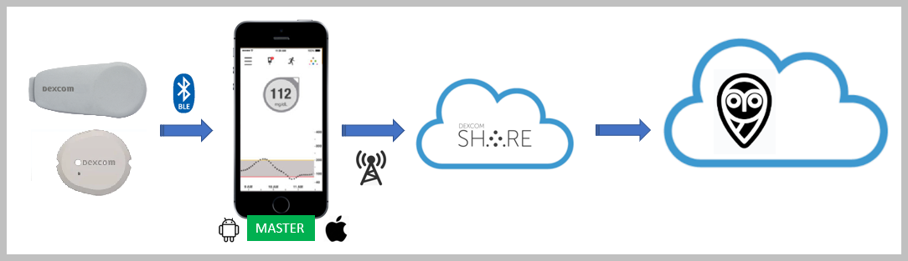
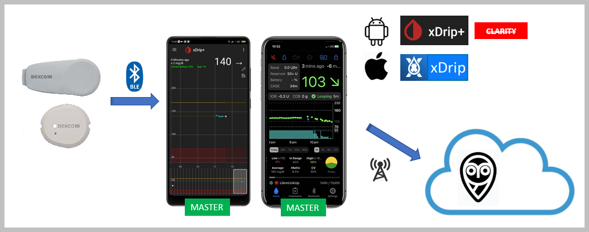
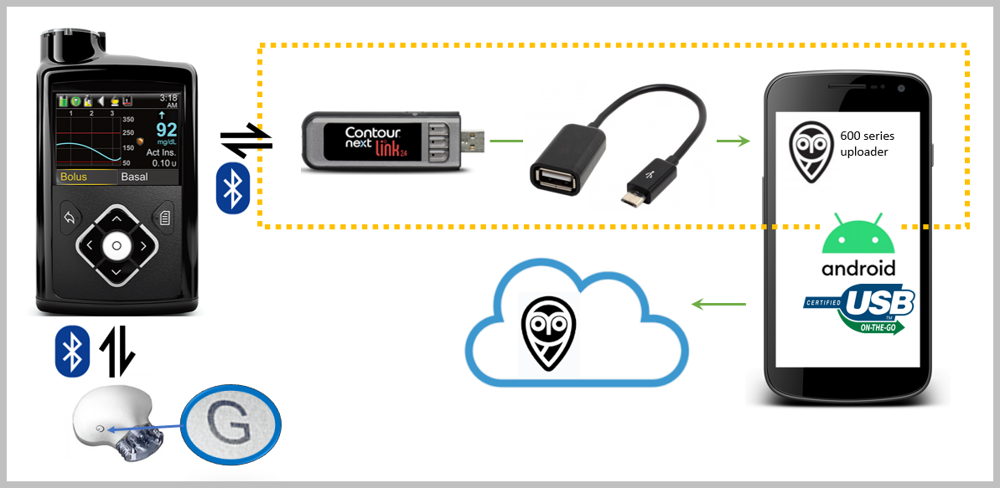
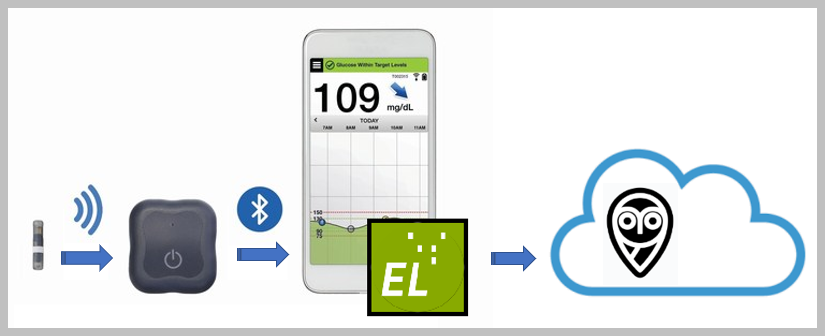

# Supported Uploaders

An **Uploader** is a mechanism or system for uploading the CGM data from your sensor to your Nightscout site. This can be either an electronic solution (usually for older devices), a simple app installed on your phone (for most newer systems) that connects to the sensor/pump and then uploads this data but also another app in the cloud acting as a "bridge" and mirroring data to Nightscout.

The type of Uploader needed will depend on the type of CGM system being used. In this page, we will break the different systems down by manufacturer, then further by sensor type.

Once you are clear about the type of sensor and upload system you will be using, you can find detailed configuration information for each one [here](/uploader/setup.md).
</br>

If you're developing an uploader, you'll find the API information in your own Nightscout site  at `/api-docs` and `/api3-docs`.

</br>

## DIY Closed loop Systems

Only your loop app should upload BG to Nightscout.

See this [dedicated page](/nightscout/close_loop) for setup links.

</br>

## Dexcom

### Dexcom G6/ONE/ONE+/G7/Stelo



If you are using a Dexcom sensor connected to the Dexcom app on your phone, it will upload directly to the Dexcom servers (also still known as "Dexcom Share") and you won't need to use any extra uploader or master device.  

```{note}
If you cannot use Dexcom Share, try xDrip+ or xDrip4iOS as a bridge to Nightscout.
```

For this to work, Nightscout must be configured to use the `bridge` plug-in and will then automatically pull the CGM information directly from the Dexcom servers in real-time.

```{note}
If you use a [DIY closed loop system](/nightscout/close_loop) it is recommended that you let it upload to Nightscout instead of importing data using Dexcom Share and the `bridge` plugin.
```

If you don't want to use the official Dexcom apps, you can use **open-source software** apps for your Dexcom sensor to connect, display, alarm and also upload to Nightscout:

**Android**: xDrip+ for G6, ONE, ONE+, Stelo and G7. <!-- xDrip+ for G4 (1)(2)(3), G5 and G6. -->

**iOS**:   
	Spike for G5 and refurbished G6 transmitters <!-- Spike or xDrip4iOS for G4 (1)(3) -->  
	xDrip4iOS for G5, G6, G7, Stelo and ONE/ONE+ transmitters



## AccuChek SmartGuide

You can use the sensor connected with [Juggluco](https://www.juggluco.nl/Juggluco/index.html) to upload to Nightscout.

## Sibionics GS1 / Hematonix

You can use the sensor connected with [Juggluco](https://www.juggluco.nl/Juggluco/index.html) to upload to Nightscout.

## Medtronic

You can use an Android phone with xDrip+. See [**here**](../../uploader/xdripcarelink) how to set it up. You can use [Guardian Monitor](https://apps.apple.com/us/app/guardian-monitor/id1546989938) with iOS.

[Home Assistant](https://github.com/yo-han/Home-Assistant-Carelink) also can upload data to Nightscout.

If your sensor/transmitter is connected an older pump (Medtronic 600 series), then you'll need an Android phone connected with an OTG cable to your pump's connected glucose meter. The phone will need to run the [600 Series Uploader](http://pazaan.github.io/600SeriesAndroidUploader/) app.



## Glucomen Day

You can forward your data from GlucoLog Web using an AWS bridge documented [here](https://github.com/yaronkhazai/gmns-bridge/tree/main/guides).

## Medtrum

You can use [this Python-based uploader](https://github.com/nl-ruud/nightscout-easyview) that retrieves CGM data from the Medtrum EasyView API and pushes it to a Nightscout instance.

## Tandem t:slim X2

You can synchronize your treatments one way from your Tandem Diabetes t:connect web/mobile application to Nightscout using  a bridge app running via **Pipenv** or **Docker** as documented [here](https://github.com/jwoglom/tconnectsync).

## Abbott Freestyle Libre

### Libre 1

Non Bluetooth-enabled Freestyle Libre sensors will need an additional transmitter device fixed on top of the sensor to send readings to the uploader device. In release order here are some transmitter options: [LimiTTer](https://github.com/JoernL/LimiTTer), BlueReader, Blucon, MiaoMiao, Bubble, Droplet and Atom.

```{admonition} Transmitter Compatibility
:class: warning
The Libre environment is complex and evolves quickly. Before buying a transmitter, please join the respective Facebook groups and make sure that the transmitter you are planning to buy is compatible with your sensor type.
```

**Open-source apps** such as **xDrip+**, **Juggluco** and **xDrip4iOS** support some of the above transmitter devices.

### Libre 2/2+

You can connect to the Libre 2 sensor (**EU only**) without an additional transmitter using [xDrip+](https://androidaps.readthedocs.io/en/latest/CompatibleCgms/Libre2MinimalL00per.html), and [xDrip4iOS](https://xdrip4ios.readthedocs.io/en/latest/connect/cgm/#libre).  
Other Libre 2 sensors can be used directly with [Juggluco](https://www.juggluco.nl/Juggluco/index.html) and Diabox.

### Libre 2/2+/3/3+

You can use the sensor connected with [Juggluco](https://www.juggluco.nl/Juggluco/index.html) or upload to Nightscout automatically from LibreView servers deploying [this](https://github.com/timoschlueter/nightscout-librelink-up) project, or use xDrip+ to perform this operation.

A new plugin called Nightscout Connect (under development) will integrate the project above.

## Eversense

In order to get data from the Eversense CGM system, you can use the [ESEL](https://github.com/BernhardRo/Esel/blob/master/apk/debug/app-debug.apk) app running on an Android phone with the [modified](https://cr4ck3d3v3r53n53.club/) vendor app, or listening to the official app glucose notifications.



You can also use [Juggluco](https://www.juggluco.nl/Juggluco/index.html) or xDrip+ in Companion App mode.

## Diasend

[diasend-nightscout-bridge](https://github.com/burnedikt/diasend-nightscout-bridge) synchronizes treatments (insulin boli, temp basal changes) as well as continuous glucose values (CGV) from Diasend to Nightscout. This can help CamAPS FX users to view their treatments and glucose values via Nightscout. A 30 minutes delay might occur.

A new plugin called Nightscout Connect (under development) will integrate the project above.

</br>