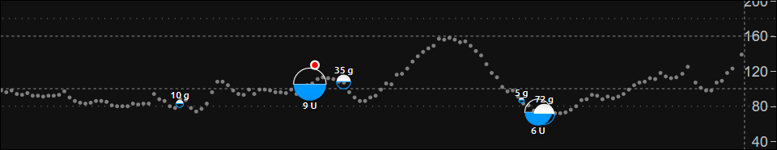

# Nightscout Configuration

**APPLIES TO:**	

------

 

You can change your default settings in the [Control Panel](https://www.t1pal.com/account/sites/my#Overview) from `Configure Nightscout`.

 

##### **API_SECRET**

!!! warning "This is an important password"
    Knowing your site's API Secret gives anybody full access to your Nightscout data, allows uploading to your site and uncontrolled access. Make sure you keep this password secret and avoid exposing it publicly.

To reveal the API_SECRET use the `Api Secret` button, it will display just below.

 

Use the View link below the Api Secret to quickly view your site.

 

##### **CUSTOM TITLE** (`Nightscout`)

!!! note "This will change your Nightscout displayed name (top left) from default."

The display name for the Nightscout site. Appears in the upper left of the main view. Often set to the name of the CGM wearer.

 

##### **CLOCK MODE**

Clock view will show you a simple view with your BG.

You can configure more clock views from your site, see [here](../../../nightscout/discover/#drawer-menu).

 

 

You can set your preferences on each browser view using the drawer menu then Settings.

If you want all browsers to open with a default configuration you need to customize it with the options shown below.

 

##### **TIME FORMAT** (`12`)

Possible values `12` or `24`

 

##### **THEME**

Default setting for new browser views, for the color theme of the CGM graph.

`default`

`colors`

 

##### **NIGHT MODE** (`off`) 

Possible values `on` or `off`

 

##### `basal` (Basal Profile)

Uses the `basal` field from the [treatment profile](https://github.com/nightscout/cgm-remote-monitor#treatment-profile).

- You can define the rendering of your basal, possible values are:

`none` (basal not displayed), 

`default`,

or `icicle` (inverted)

 

## Plugins

Plugins are used to extend the way information is displayed, how notifications are sent, alarms are triggered, and more.  

If you want the enabled plugins to **show by default on any browser**, you should add them to the `Enabled plugins` list.

To learn more about plugins see [here](../../../nightscout/setup_variables/#plugins).

 

##### **DISPLAY UNITS**

Preferred BG units for the site: `mg/dl` or `mmol` (mmol/l).

 

## Advanced Plugins:

##### `careportal` (Care Portal)

An optional form to enter treatments.

Care Portal is an important plugin that gives access to the `Log a treatment` interface. Unlock it entering your API secret with the lock icon top right, then use the `+` icon to log a treatment.  More information [here](../../../nightscout/discover/#add-a-treatment-careportal).

 

##### `cage` (Cannula Age) / `sage` (Sensor Age) / `iage` (Insulin Age) / `bage` (Battery Age)

##### `cage` (Cannula Age)

Calculates the number of hours since the last `Site Change` treatment that was recorded.

- `ENABLE ALERTS` (`display`) - Set to `alert` to enable notifications to remind you of upcoming cannula change.
- `CANNULA AGE DISPLAY` (`hours`) - Possible values are `hours` or `days`. If `days` is selected and age of canula is greater than 24h number is displayed in days and hours
- `CANNULA AGE INFO` (`44`) - If time since last `Site Change` matches this value, user will be warned of upcoming cannula change
- `CANNULA AGE WARNING` (`48`) - If time since last `Site Change` matches this value, user will be alarmed to to change the cannula
- `CANNULA AGE URGENT` (`72`) - If time since last `Site Change` matches this value, user will be issued a persistent warning of overdue change.

##### `sage` (Sensor Age)

Calculates the number of days and hours since the last `Sensor Start` and `Sensor Change` treatment that was recorded.

- `ENABLE ALERTS` (`display`) - Set to `alert` to enable notifications to remind you of upcoming sensor change.
- `SENSOR AGE INFO` (`144`) - If time since last sensor event matches this value, user will be warned of upcoming sensor change
- `SENSOR AGE WARNING` (`164`) - If time since last sensor event matches this value, user will be alarmed to to change/restart the sensor
- `SENSOR AGE URGENT` (`166`) - If time since last sensor event matches this value, user will be issued a persistent warning of overdue change.

##### `iage` (Insulin Age)

Calculates the number of days and hours since the last `Insulin Change` treatment that was recorded.

- `ENABLE ALERTS` (`display`) - Set to `alert` to enable notifications to remind you of upcoming insulin reservoir change.
- `INSULIN AGE INFO` (`44`) - If time since last `Insulin Change` matches this value, user will be warned of upcoming insulin reservoir change
- `INSULIN AGE WARNING` (`48`) - If time since last `Insulin Change` matches this value, user will be alarmed to to change the insulin reservoir
- `INSULIN AGE URGENT` (`72`) - If time since last `Insulin Change` matches this value, user will be issued a persistent warning of overdue change.

##### `bage` (Battery Age)

Calculates the number of days and hours since the last `Pump Battery Change` treatment that was recorded.

- `ENABLE ALERTS` (`display`) - Set to `alert` to enable notifications to remind you of upcoming pump battery change.

- `BATTERY AGE DISPLAY` (`days`) - Set to `hours` to display time since last `Pump Battery Change` in hours only.

- `BATTERY AGE INFO` (`312`) - If time since last `Pump Battery Change` matches this value hours, user will be warned of upcoming pump battery change (default of 312 hours is 13 days).

- `BATTERY AGE WARNING` (`336`) - If time since last `Pump Battery Change` matches this value hours, user will be alarmed to to change the pump battery (default of 336 hours is 14 days).

- `BATTERY AGE URGENT` (`360`) - If time since last `Pump Battery Change` matches this value hours, user will be issued a persistent warning of overdue change (default of 360 hours is 15 days).

   

##### `pump` (Pump Monitoring)

Generic Pump Monitoring

- `ENABLE ALERTS` (`display`) - Set to `alarm` to enable notifications for Pump battery and reservoir.
- `WARN ON SUSPEND` (`display`) - Set to `alert` to get an alarm when the pump is suspended.
- `PUMP FIELDS` - The fields to display by default. Any of the following fields: `reservoir`, `battery`, `clock`, `status`, and `device`
- `PUMP RETRO FIELDS` - The fields to display in retro mode. Any of the above fields.

 

## Alarms

These alarm setting affect all delivery methods (browser, Pushover, IFTTT, etc.). Values and settings entered here will be the defaults for new browser views, but will be overridden if different choices are made in the settings UI.

 

##### **ALARM TYPES** 

!!! note "TYPES"
    Keep the `simple` type if you want Custom threshold parameters (setup below) to be used. 

`Simple` and/or `Predictive`. 

Simple alarms trigger when BG crosses the various thresholds set below.

Predict alarms uses highly tuned formula that forecasts where the BG is going based on its trend. You will ***not*** get warnings when crossing any of the BG thresholds set below when using ***only*** the predict type.

 

##### **When last reading is more than**

A warning alarm when CGM data hasn't been received in the number of minutes set in the field. `warn` or `do nothing`.

##### **Urgent alarm when time ago exceeds** 

An urgent alarm when CGM data hasn't been received in the number of minutes set in the field. `alarm` or `do nothing`.

 

!!! note "BG Thresholds"
    These values are the ones that will trigger `simple` alarms. They are expressed in the unit you selected with `DISPLAY_UNITS`.

##### **High BG**

Urgent High BG threshold, triggers the `ALARM_URGENT_HIGH` alarm.

##### **Target Top**

High BG threshold, triggers the `ALARM_HIGH` alarm.

##### **Target Bottom**

Low BG threshold, triggers the `ALARM_LOW` alarm.

##### **Low BG**

Urgent Low BG threshold, triggers the `ALARM_URGENT_LOW` alarm.

 

!!! note "`ALARM_*` `ALARM_URGENT_*`"
    You can setup alarms, so that when your Nightscout page is open and the alarm enabled, above (`HIGH`) or below (`LOW`) a certain threshold, a sound might play.

 

##### Red bin

Not yet enabled.