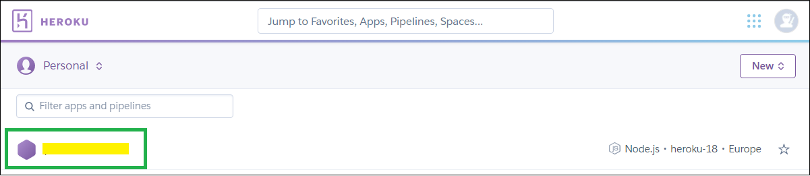

# Migrate Nightscout from Heroku to Azure

<span style="font-size:smaller;">**APPLIES TO:**</span>  +  + 

Yes! Azure is [back](https://news.microsoft.com/features/open-source-and-the-cloud-changing-the-lives-of-people-with-type-1-diabetes)!

</br>

!!!info "Too complicated? Not what you're looking for? Consider a hosted Nightscout service! Check for easier solutions [here](../../../#nightscout-as-a-service)."  
<span style="font-size:larger;">Interested in building a Nightscout DIY site?  Make sure you **read and understand [this](/#how-much-does-it-cost)** before starting.</span>

</br>

**Pros**:  

> Large platform with proven reliability  
> Well known by the community IT specialists  
> Subscribe to a Basic plan using free services

**Cons**:  

> Using the M0 [MongoDB Atlas](../../mongodb/atlas/) database  
> **[Free service plan](https://azure.microsoft.com/en-us/pricing/details/app-service/windows/) is intended to be used only for development and testing purposes**

</br>

## Step 1: Create an Azure account

a) Open a web page in [https://azure.microsoft.com/en-us/free/](https://azure.microsoft.com/en-us/free/) and click Start Free.


</br>

b) Sign in with your Microsoft account if you have one, else use GitHub.


</br>

c) Agree and click Next.  
Perform necessary authentication.


</br>

## Step 2: Create your Nightscout web app

> This is the web page you'll be able to access from any device connected to the internet

a) From the top left ☰ menu or the Azure Services icons, select + Create a resource.


</br>

b) Search Web app and click Create.


</br>

c) Below Resource group click Create new and enter Nightscout (for example).  


</br>

d) Check you're still using your Free Trial or 3-Month free Trial.


</br>

e) Decide your site name (only lowercase and you can use `-` as a separator).  
It must be unique: check the tick box at the end of the line is green.  
If it isn't: you need to choose another name...


</br>

f) Now select a Docker container, in Linux.

Pick a place close to where you live in the Region selection.


</br>

g) Change the plan size.


Select Dev /Test, F1 Free and click Apply.


</br>

h) Click Next: Docker > in the lower left of the page.


</br>

i) In Image source select Docker Hub.


</br>

j) In Image and tag paste the following name:

```
nightscout/cgm-remote-monitor:latest
```


!!!note "Using a Development version"  
    Do not use a `dev` version unless you know exactly why you want to do this.  
    Type this: `nightscout/cgm-remote-monitor:latest_dev`

</br>

k) Click Review + create in the lower left of the page.


</br>

l) Verify the summary information:  
Free sku  
Check the site Name is what you wanted  
then click Create.


</br>

Wait for the deployment to complete. Do not interfere.


</br>

Congratulations, you have created your Nightscout web app.

</br>

## Step 3: Configure your Nightscout web app

> Now you need to copy your variables from Heroku as there is no migration utility to do this...

a) Click Go to resource


</br>

b) In the left menu select Configuration


</br>

c) Open a new browser tab or window and Log in [Heroku](https://id.heroku.com/login), select your app



</br>

d) Click `Settings`


</br>

e) Scroll down and click `Reveal Config Vars`


</br>

f) Put the two windows Heroku and Azure side by side


</br>

Now for every (no, not necessarily, read until **i** and come back) variable you need to do the following:

g) Click + New application setting


</br>

h) In Name write the variable name from the first column in Heroku  
Then, in the line below, Value, paste the value from the second column in Heroku.


Then click OK and go for the next one.

</br>

i) You might not need to copy ALL the values, if you know which ones you need you can go ahead.  
If you don't really know which ones you want to copy there's only few that are strictly necessary:

**`API_SECRET`**  
**`MONGODB_URI`**  *Note: if you don't see `MONGODB_URI` but see `MONGO_CONNECTION` (NOT `MONGO_COLLECTION`) use its value.*  
**`DISPLAY_UNITS`**

in `ENABLE` paste this:

If you don't use Dexcom Share to get your BG data in Nightscout, copy the line below to Value:

```
careportal basal dbsize rawbg iob maker cob bwp cage iage sage boluscalc pushover treatmentnotify loop pump profile food openaps bage alexa override speech cors
```

If you want to use Dexcom Share as a data source copy this one (it includes the keyword `bridge`):

```
careportal basal dbsize rawbg iob maker cob bwp cage iage sage boluscalc pushover treatmentnotify loop pump profile food openaps bage alexa override speech cors bridge
```

If you have your data coming directly from Dexcom share those three:

`BRIDGE_USER_NAME`  
`BRIDGE_PASSWORD`  
`BRIDGE_SERVER`


</br>

j) When you're done copying, click Save, then Continue.


</br>

k) From the menu select Overview, then Browse.


It will take some time before the window opens.

</br>

## Step 4 - Update your uploaders and downloaders

Now you will need to update all the devices connected to Nightscout with the new web address.

!!!warning "Change the URL!"  
    Note that Azure will display he same information than Heroku even if you don't do so, but this will stop when Heroku will shutdown the free service.  
    **Make sure you update the [uploader](../../../uploader/setup/) and [follower](../../../nightscout/downloaders/) devices with the new code.run address!**

#### Uploaders

For Dexcom users, if you use the bridge plugin you should be set.  
xDrip+ users (including Medtronic CareLink followers) should update the uploader as shown [here](../../../uploader/setup/#xdrip).  
xDrip4iOS users [here](https://xdrip4ios.readthedocs.io/en/latest/connect/cgm/#nightscout-upload).  
[AAPS](https://androidaps.readthedocs.io/en/latest/Configuration/Preferences.html#nsclient) and [Loop](https://loopkit.github.io/loopdocs/operation/loop-settings/services/): consult the relative documentation to change your site name.

</br>

To fully test your new Azure Nightscout app: put your Heroku app in [maintenance mode](../../../troubleshoot/heroku/#maintenance-mode).  
If things don't go as expected, you can disable it and return to Heroku whilst you fix it.  
**Better test it now than once Heroku will shutdown your app.**

</br>