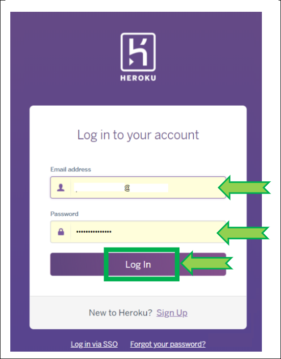

# Migrate from Heroku to Fly.io keeping your MongoDB Atlas database

!!!warning "Migration is not recommended"  
    If you want to migrate your site in Fly.io make sure you will be able to **maintain it**.  
    It might be better to [deploy a new Fly.io Nightscout](../new_user) site and copy your Heroku variables.

 

**APPLIES TO:** +

!!!info "Too complicated? Not what you're looking for? Consider a hosted Nightscout service! Check for easier solutions [here](../../../#nightscout-as-a-service)."  
Interested in building a Nightscout DIY site?  Make sure you **read and understand [this](/#how-much-does-it-cost)** before starting.

 

**Pros**:  

> Pay-as-you-go Hobby plan allows you to run Nightscout [for free](https://fly.io/docs/about/pricing/#plans)  
> Migration process is really simple  

**Cons**:  

>Using the M0 [MongoDB Atlas](../../mongodb/atlas/) database  
>  While migration is extremely easy, maintenance and upgrades involve CLI and are complex  

 

## Step 1 - Migrate your Heroku app to Fly.io

a) Open the Fly.io Heroku migration page [https://fly.io/launch/heroku](https://fly.io/launch/heroku).

 

b) Click `Sign in to Heroku`.

 

c) Enter your Heroku credentials and `Log In`.

 

d) `Allow` Fly.io to access your Heroku account.

 

e) In `Configure Heroku` you should see your name in the organization.

 

f) For `PICK AN APP NAME` put the name of your new Fly.io Nightscout site (you can put the same than Heroku if you want).

 

g) [`REGION`](https://fly.io/docs/reference/regions/) is the physical location closer to you where the app will run. Leave default.

 

h) The Heroku app you need to choose here is your Heroku Nightscout app.

 

i) Click `Deploy Heroku app!`

 

j) You need to enter a physical identification (to demonstrate you're not a robot) this will be done using a credit card.  
Select `Click here to add a payment method...`

 

k) Enter you credit card information and click `Save Card`. You will be billed 0$ or a bank fee.

 

l) You should be driven back to the screen shown on step i.  
If you're not, retry from the beginning and now Fly.io shouldn't ask for a credit card anymore.

Deploy will start. Be patient and don't click anything until it's complete. It might take up to 20 minutes.

 

m) When deployment is complete you will see the information of your new Fly.io Nightscout site.  
The App URL is your Nightscout site web address, only it's ending by `.fly.io` instead of `.herokuapp.com`.

 

n) If you open this URL you will see it's replicating real time your Heroku Nightscout with the exact same settings.

 

## Step 2 - Remove the Heroku webhook to Fly.io

a) By defaut Fly.io has made a link to Heroku so that whatever happens in Heroku (updates, variables changes, etc...) is mirrored to Fly.io.  
**You don't want this.  
You need to detach Fly.io from Heroku now.**

Log in Heroku [https://id.heroku.com/login](https://id.heroku.com/login)

 

b) Select your Nightscout app, top right `More`, then `View Webhooks`.

 

c) Scroll down to your webhook, open the menu at the end of the line and `Remove` it.

 

d) Confirm with `Delete`.

 

Your Fly.io Nightscout is now independent from Heroku.

 

## Step 3 - Backup your Heroku variables

!!!warning "Heroku Variables"  
    You cannot see your variable values in Fly.io.  
    You cannot edit them.  
    You MUST have a backup of your Heroku variables for maintenance purposes.

Reveal your Heroku Nightscout app [Config Vars](/heroku/new_user/#editing-config-vars-in-heroku) and copy all variables names and values in a spreadsheet.

!!!warning "Save this information in a safe place!"

 

## Step 4 - Install Fly.io command line interface 

!!!warning "Fly.io flyctl"  
    You MUST be able to use this program in order to maintain your Fly.io Nightscout app.

Follow the example [here](../new_user/#editing-config-vars-in-flyio) and confirm you can get it to behave as expected.  
Your Fly.io app name is the one you defined above in step 1.f.

 

## Step 5 - Update your uploaders and downloaders

Now you will need to update all the devices connected to Nightscout with the new web address.

!!!warning "Change the URL!"  
    Note that Fly.io will display he same information than Heroku even if you don't do so, but this will stop when Heroku will shutdown the free service.  
    **Make sure you update the [uploader](../../../uploader/setup/) and [follower](../../../nightscout/downloaders/) devices with the new code.run address!**

#### Uploaders

For Dexcom users, if you use the bridge plugin you should be set.  
xDrip+ users (including Medtronic CareLink followers) should update the uploader as shown [here](../../../uploader/setup/#xdrip).  
xDrip4iOS users [here](https://xdrip4ios.readthedocs.io/en/latest/connect/cgm/#nightscout-upload).  
[AAPS](https://androidaps.readthedocs.io/en/latest/Configuration/Preferences.html#nsclient) and [Loop](https://loopkit.github.io/loopdocs/operation/loop-settings/services/): consult the relative documentation to change your site name.

 

To fully test your new Fly.io Nightscout app: put your Heroku app in [maintenance mode](../../../troubleshoot/heroku/#maintenance-mode).  
If things don't go as expected, you can disable it and return to Heroku whilst you fix it.  
**Better test it now than once Heroku will shutdown your app.**

 
