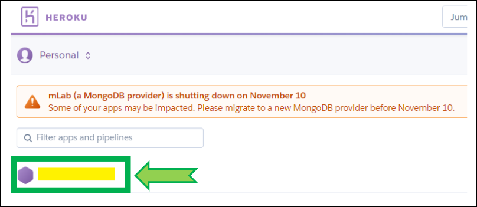

# Heroku Eco plan

**APPLIES TO:**	

 

## [End of Free plan](https://blog.heroku.com/next-chapter)

Starting October 26, 2022, Heroku began deleting accounts that have been inactive for over a year.

Starting November 28, 2022, Heroku will stop offering free product plans and start shutting down free dynos and data services. Free accounts are converted to Eco plan with dynos sized zero (i.e. stopped without billing).

This means that if you wish to continue using Heroku you need to upgrade your free plan.

 

!!!info "Too complicated? Not what you're looking for? Consider a hosted Nightscout service! Check for easier solutions [here](../../../#nightscout-as-a-service)."  
Interested in building a Nightscout DIY site?  Make sure you **read and understand [this](/#how-much-does-it-cost)** before starting.

 

**Pros**:  

> Heroku is a reliable platform well known by the community  
> The Eco plan is made for personal apps  
> Nightscout fits in 1000 dyno hours per month  
> Heroku has been hosting Nightscout users for years in the free tier  

**Cons**:  

>Using the M0 [MongoDB Atlas](../../mongodb/atlas/) database  
>Paying for an Eco plan doesn't remove DIY maintenance tasks like stack upgrade  
>Eco plan apps will sleep after 30 minutes of inactivity  

 

## Enable a 5$/month Eco Plan

 

- Log in Heroku [https://id.heroku.com/login](https://id.heroku.com/login)

 

- Select your app (hidden in yellow)

 

- Click `Resources` then select `Change Dyno Type`

 

- Select `Eco ($5 for 1000 Dyno Hours/Month)` then click `Save`

 

- Your Nightscout Heroku app is now using an `Eco` plan.

- **Make sure your credit card information is up to date!**  
  Go to your `Account settings`.

- `Billing`

- Verify the credit card you used is still valid, in case of doubt `Change credit card` and enter a valid credit card.

 

 

### Prevent your Nightscout app from falling asleep

!!!warning "Use with caution"  
    If an app fails and crashes at startup (database full), if you entered wrong credentials and the app stops for missing data activity, using this trick to keep it alive will not help. It might even make things worse in the case of wrong Dexcom credentials and lead to a locked account.

This is necessary if you don't have an uploader sending data to Nightscout, or a follower polling data from it.  
For example using the bridge plugin.

- You can use monitoring webapps like Uptime Robot, New Relic, ...

 
