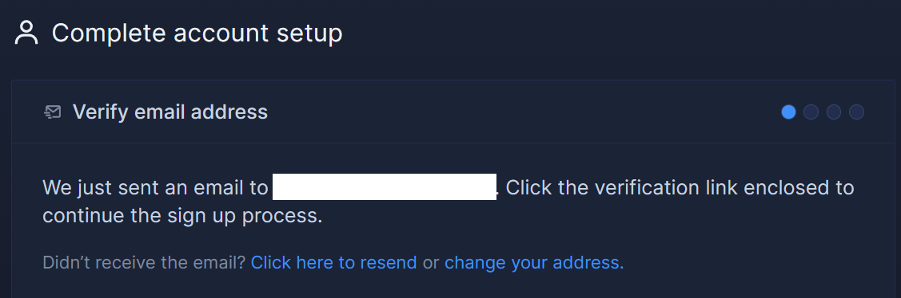
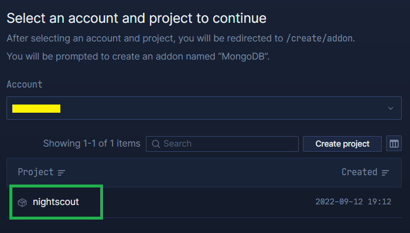
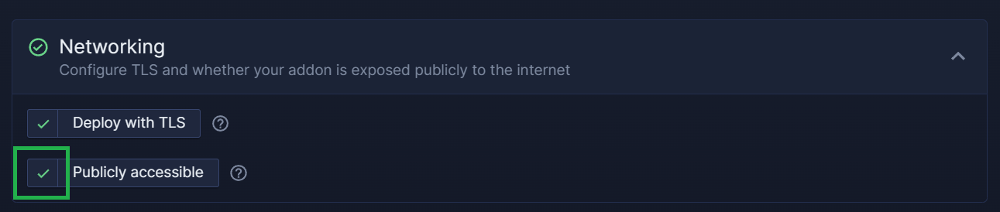
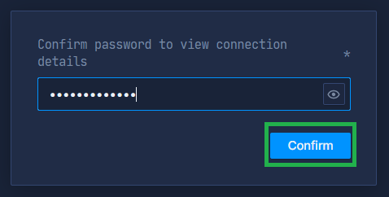
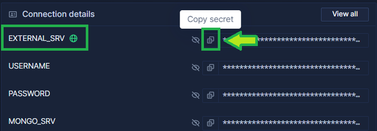

# Northflank Database

</br>

```{admonition} Too complicated? Not what you're looking for?
:class: seealso
Consider a hosted Nightscout service! Check for easier solutions [here](/index.md#nightscout-as-a-service).
```

</br>

```{card}
## Northflank Mongo Database
 
^^^
Northflank offers a Mongo database.

**Pros**:  
* Simple to create  
* Economic reliable database
* High quality Mongo database with a replica set

**Cons**:  
* Billing starts at 0.3$ plus 0.3$ per additional GiB (it can take years to reach 1GiB for Nightscout)
```

</br>

If you already have a Northflank account, [log in](https://app.northflank.com/login) and [continue (skip new account creation)](#create-your-database).

**Else**

## Create an account with Northflank

a) Sign-up to [Northflank](https://app.northflank.com/signup) in a new browser tab.  
Fill all required fields and `Sign up`.  
You can also sign up with Google, GitHub, ... if you wish.


</br>

Northflank will send you an email to complete the registration.



</br>

b) Open your email and confirm with `Verify email`.


</br>

c) Click `Choose theme`.


</br>

d) Select `Skip for now`.


</br>

e) Click `Create free project`


</br>

f) Invent a project name (`nightscout` for example) and select a region (Europe or US) then click `Create project`


</br>

</br>

## Create your database

```{admonition} Costs
:class: warning
* The Mongo database is free, you only pay for the storage
* Minimum price is 0.3$/month, cost is then 0.3$/GiB/month
* A good database is important for your Nightscout site reliability
```

</br>

a) Open a new browser page [https://northflank.com/dbaas/mongodb-on-northflank](https://northflank.com/dbaas/mongodb-on-northflank) and click `Deploy MongoDB on Northflank for free`


</br>

b) Select your account and your project name (see below if you don't have one yet).



</br>

If you don't have a project in Northflank, create a new one with `Create project` and then select `Create free project` else skip to **c)**.


Invent a project name (`nightscout` for example) and select a region (Europe or US) then click `Create project`


</br>

c) Select `Deploy addons`.


</br>

d) Select `MongoDB` and type a name for your addon (not important) in `Addon name`.


</br>

e) The database add-on configuration displays, scroll down.

*Note: if you know what you're doing, all Mongo versions are supported by Nightscout: you can select the one you prefer.*

**Important:** If you will use this database with a Nightscout that is not in Northflank, you must enable `Publicly accessible`.  
If you will deploy Nightscout in Northflank, you can leave it disabled.



</br>

f) Select `Create addon`


</br>

g) If you haven't yet, you need to add a payment method into Northflank.  
You will be charged monthly for your database (0.3$ up to 1 GiB, then 0.3$/GiB).


</br>

g) Enter your password and click `Confirm` to see your MongoDB information.



</br>

h) Click the copy icon of the line `EXTERNAL_SRV`.



</br>

```{admonition} This is an important information
:class: warning
Now that you have **copied** the resulting `MONGODB_URI` string, keep it in a **safe place**, you will need it later.
```

</br>

i) Wait until your database is fully created. It might take some time.


</br>