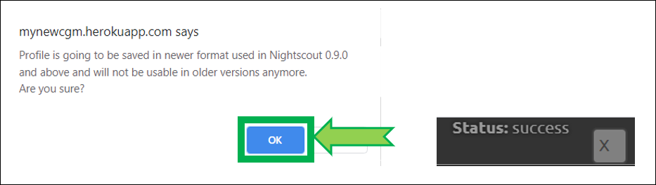

# Northflank Nightscout

---

<span style="font-size:smaller;">**APPLIES TO:**</span> 

---

!!!info "Cost"

You can migrate from Heroku to Northflank and **keep your Nightscout site for free** (maintaining your MongoDB Atlas database).

!!!warning "Database"  
    Adding a database to your Northflank account will increase costs.

</br>

<span style="font-size:larger;">Consider [Nightscout as a service](/#nightscout-as-a-service) as an option.</span>

</br>

## Set up a new Nightscout

### Create your Northflank and GitHub accounts from a computer.

!!!note  
    Do not change device/computer/browser during the setup process!  
    If you have unexpected issues when creating your site, restart with another browser.

</br>

### Step 1: Create a GitHub account

</br>

If you already have a GitHub account, [update](../../../nightscout/github/#update-your-nightscout-fork) your Nightscout project.

If you don't have a GitHub account [create one](../../../nightscout/github/#create-a-github-account) then [fork the Nightscout project](../../../nightscout/github/#fork-the-nightscout-project) and come back.

</br>

### Step 2: Create a Northflank account and deploy `cgm-remote-monitor`

a) Sign-up to [Northflank](https://app.northflank.com/signup) in a new browser tab. Login with GitHub (click on the logo).


</br>

b) Confirm your GitHub account if required.


</br>

c) Select `Only select repositories`, in the drop-down list select `cgm-remote-monitor` then click `Install & Authorize`.


</br>

c) Enter a user name, your email address and invent a password (type it twice to confirm). Accept the TOS and Privacy Policy then click  `Continue `.


</br>

d) Click `Choose theme`.


</br>

e) Select `Skip for now`.


</br>

f) Select `Create free project`.


</br>

g) Enter a project name (for example nightscout) and select a region (you can make it geographically close to where you live) then click `Create project`.


</br>

h) Select `Add new service`.


</br>

i) Don't change anything and scroll down to `Service name`. Click `Suggest random name`.


</br>

j) Select your `cgm-remote-monitor` and the `master` branch.


</br>

k) In `Buid options` select `Buildpack`.


</br>

l) Expand `Variables` and click `Add variable`.


</br>

m) Setup your Nightscout core variables.

!!!note "Migrating from Heroku"  
    If you're migrating your project from Heroku, [display all variables in Heroku](../../heroku/new_user/#editing-config-vars-in-heroku) and copy all those with a value into Northflank.  
    See below how to add variables in Northflank but use your Heroku variables values.

`API_SECRET` will be your Nightscout site password, it needs to be at least 12 characters long and you should **NOT use spaces** if you use @ or ! symbols remember you will probably need to express them using [Percent encoding](https://en.wikipedia.org/wiki/Percent-encoding#Percent-encoding_reserved_characters) in your uploader and downloader apps. If you're not sure on how to do this, it is recommended to use only letters (uppercase + lowercase) and digits.

!!!warning "The API_SECRET is the **main password allowing full access to your Nightscout site**. Make sure it's reasonably secure (mix uppercase and lowercase letters, plus digits) and **do no not share it publicly**. If you think you exposed it by mistake, it is recommended that you **change it**."


Click `Add variable` each time to add another one.

</br>

##### Dexcom Bridge

n) If you use [Dexcom `bridge`](../../../troubleshoot/dexcom_bridge/) you need to configure these two variables with your Dexcom credentials:


If you're using Dexcom Share in the US you should put **US**, in **any other case it must be EU**.  
If you don't see it proposed at this point you'll need to **browse the list below to find it and modify it**.


**Remember to add `bridge` at the end of the `enable` variable in the list below.**

!!!info "MOST COMMON ERRORS"
    The most common error on initial Nightscout setups is that people incorrectly use an old account or an old password. To test your username and password, go to Dexcom's Clarity page (check [here for USA accounts](https://clarity.dexcom.com) and [here for the others](https://clarity.dexcom.eu)) and try logging in to your Dexcom account. If your account info isn't valid, or you don't see any data in your Clarity account... you need to figure out your actual credentials before moving ahead. See [here](../../../troubleshoot/dexcom_bridge/) for troubleshooting tips and information on your Dexcom account.

!!! note "Password"
    *Some people have had problems with their bridge connecting when their Dexcom passwords are entirely numeric. If you have connection issues in that case, try changing your password to something with a mix of numbers and letters.*

!!! info
    You need to have at least one follower to use Dexcom Share. See [here](../../../uploader/setup/#dexcom).

</br>

o) Select the units you’re using in `DISPLAY_UNITS` acceptable choices are `mg/dl` or `mmol/L` (or just `mmol`).


</br>

p) You can add alarms values. See [here](../../../nightscout/setup_variables/#alarms) for the meaning of each one.


</br>

q) If you want to ensure that ONLY someone with permission to view your site (e.g., a token or the `API_SECRET`) is able to view the data, you should configure the [`AUTH_DEFAULT_ROLES`](../setup_variables/#auth_default_roles) variable in as `denied`.  
If you want your site to be visible to anybody leave it as `readable`.


</br>

r) In [`ENABLE`](../../../nightscout/setup_variables/#enable), copy and paste the following words (separated by a space) so that won't have to think about which you want now:

```
careportal basal dbsize rawbg iob maker cob bwp cage iage sage boluscalc pushover treatmentnotify loop pump profile food openaps bage alexa override speech cors
```

**If you are using your Dexcom share account as a data source** also add `bridge` at the end, after a space like this:

```
careportal basal dbsize rawbg iob maker cob bwp cage iage sage boluscalc pushover treatmentnotify loop pump profile food openaps bage alexa override speech cors bridge
```


</br>

s) You can modify the variables values, check the [documentation](../../../nightscout/setup_variables) for the meaning of each one.  
Make sure you don't make typo errors, some will crash your site (like for example `LANGUAGE` value in upercase).

</br>

t) add a 3 to 8 letter code to your URL.


</br>

u) Scroll down and click: `Create Service`


</br>

v) You now need to add a payment method.


</br>

w) Wait until your build completes. You will see a green cloud when done, it will take less than 15 minutes.


</br>

</br>

### Step 3: Create your database

!!!note "Already have a database?"  
    If you're migrating from another platform and you already have database connection string from another Nightsout deployment, just copy the `MONGODB_URI` or `MONGO_CONNECTION` string and keep your data!

You have several choices.

- #### You can reuse your existing MongDB Atlas database.    

!!!info "Costs"  
    Recommended for Heroku migration.

Migrating from Heroku? [Edit your Heroku site variables](../../heroku/new_user#editing-config-vars-in-heroku) and copy the `MONGODB_URI` or `MONGO_CONNECTION` variable.  
    Lost your string? [Recover it](../../../troubleshoot/atlas/#recover-your-connection-string) from MongoDB Atlas.

- #### You can create a new MongoDB Atlas database.

!!!info "Costs"  
    Recommended for a free Nightscout site.

To create a new MongoDB database follow [these instructions](../../mongodb/atlas/#create-an-atlas-database) and come back with your `MONGODB_URI` connection string.  
The Atlas database size is limited to 512MB of data and is free to try. This might evolve in the future.

- #### You can create a new Northflank Mongo database.

!!!warning "Costs"  
    Minimum price is 0.3$ per GB per month.

</br>

a) Create a new MongoDB database in Northflank. Open a new browser page [https://northflank.com/dbaas/mongodb-on-northflank](https://northflank.com/dbaas/mongodb-on-northflank).


</br>

b) Select your account and project (for exmple `nightscout` below).


</br>

c) Click `Create addon`.


</br>

d) Enter your password and click `Confirm` to see your MongoDB information.


</br>

e) Click the copy icon of the line `EXTERNAL_SRV`.


</br>

!!!warning "This is an important information"

Now that you have **copied** the resulting `MONGODB_URI` string, keep it in a **safe place**, you will need it later.

</br>

</br>

### Step 4: Attach your database to your Nightscout site

</br>

a) Browse back into your project `Service ` then `Environment`, click `Edit`.


</br>

b) Select `Add variable ` at the end of the list.


</br>

c) Name it MONGODB_URI and paste the string you obtained at **Step 3**.


</br>

d) Click `Update and restart ` bottom right.


</br>

d) To open your Nightscout site, navigate to your project `Services ` and click the address link top right.


</br>

e) Your Nightscout site should open and direct you to a new profile creation.


</br>

f) Setup your `Time zone` and eventually all other fields. Do not leave any fields empty. If you don't know which value to use, just use the default value. You can change these values later at any time.


</br>

g) Browse down to `Authentication status` and click `Authenticate`. Enter your API secret. Click `Update`.


</br>

h) Click `Save`.


</br>

i) If the following pop-up shows up click `OK`, and check status (upper right of the window).



</br>

j) If you need to modify your profile after this, authenticate with the lock icon (top right of the page): enter your API secret. Then click on the hamburger menu and select `Profile Editor`.


</br>

!!!warning "Privacy warning"
    Anyone with access to the URL of your Nightscout site, can view your BG and run reports of your data. It it strongly recommended that you enable [security](../../../nightscout/security) to your site once you're done with the setup.  

</br>

x) Dexcom Share and CareLink users should see data flowing in after some minutes. Other uploaders like xDrip+, Spike, xDrip4iOS, etc will need to be setup with the Nightscout address and API secret in the app.


</br>

## Change your Northflank Nightscout site name

To be documented [if possible](https://northflank.com/docs/v1/application/network/configure-ports#public-ports).

</br>

Change all your [uploaders](../../../uploader/setup/) and [follower](../../../nightscout/downloaders/) devices to reflect the new URL once verified correct functioning of your Nightscout site.

</br>

## Migrate your MongoDB Atlas database to Northflank 

To be documented.

</br>

## Editing Variables in Northflank 

</br>

a) Open [Northflank](https://app.northflank.com/login) and login with your username or with GitHub.


</br>

b) Select `Services ` then your Nightscout project.


</br>

c) Select `Environment` then `Edit`.


</br>

e) You can perform various operations on your variables:

1. Add a new variable with `+ Add Variable`
2. Edit variables values directly in the table
3. Delete a variable with the bin icon

Don't forget to `Update & restart` when you're done editing.

</br>