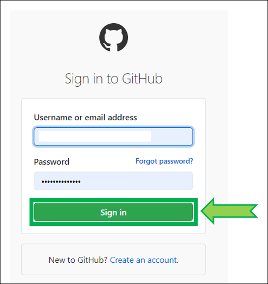

# Migrate from Heroku to Railway

---

**APPLIES TO:**   +   ⟹    + 

---

!!!info "Cost"  
    [Railway](https://railway.app/) offers 500 free hours of execution usage per month for the [Starter plan](https://docs.railway.app/reference/plans#starter-plan) **this is not enough to cover a full month**. Running multiple free accounts to override this limitation is [not acceptable](https://railway.app/legal/fair-use).  
      
      
    **You can migrate from Heroku to Railway and keep your Nightscout site for free (maintaining your MongoDB Atlas database) by subscribing to a [Developer plan](https://railway.app/pricing)**.

Keep in mind the free M0 MongoDB Atlas database size is limited to 512MB and you will eventually need to perform [cleanup](../../../nightscout/admin_tools/#database-maintenance), make sure you add [`dbsize`](../../../nightscout/setup_variables/#dbsize-database-size) in `enable` to avoid unexpected Nightscout failure. You can increase database size with an [M2 shared cluster](https://www.mongodb.com/docs/atlas/manage-clusters/#shared-clusters), the additional cost is 9$ per month.

Consider [Nightscout as a service](/#nightscout-as-a-service) as an option.

 

## Step 1 - Update your Github repository

a) Click here to log in at GitHub: [https://github.com/login](https://github.com/login).

b) Enter your username or email and your password. Click `Sign in`

 

c) Select your own `cgm-remote-monitor` project (**not `nightscout/cgm-remote-monitor`**)

 

d) Your repository will open. If you see `This branch is xxx commits behind nightscout:master` you need to update.  
If you see `This branch is up to date with nightscout:master`, leave the GitHub page opened and go directly to [Step 2](#step-2-create-a-railway-account).

e) Select `Fetch upstream`

 

f) Select `Fetch and merge`

 

g) After a moment, your repository should display `This branch is up to date with nightscout:master`

If you ran into trouble upgrading (your branch is not up to date): [delete](../../../nightscout/github/#delete-your-own-fork-of-cgm-remote-monitor) and [fork again](../../../nightscout/github/#fork-the-nightscout-project) your `cgm-remote-monitor` repository.

Leave the GitHub page opened.

 

## Step 2 - Create a Railway account

a) Open [Railway](https://railway.app) in a new browser tab and click `login`. Login with GitHub.

 

b) Select `Authorize Railway App`.

 

c) Click on `Please agree to the new terms to keep on using Railway`.

 

d) Scroll down and click `I agree with Railway's Terms of Service`.

 

e) Scroll down and click `I will not deploy any of that`.

 

f) You now need to upgrade your account to a Developer plan. Click on the `Starter Plan` information and select `Remove Resource Limits`.

 

g) Enter your credit card information and select `Subscribe to a Developer Plan`.

Your card will be billed 1$ that will be refund immediately. Bank fees won't be refund.

 

## Step 3 - Log into Heroku

- Log in Heroku [https://id.heroku.com/login](https://id.heroku.com/login)

- Leave the Heroku page opened and return to the Railway page.
- If you cannot log into Heroku, follow the [new user guide](../new_user) and reuse your existing Atlas database.

 

## Step 4 - Deploy Nightscout in Railway

a) Click on `Create a New project`.

If you don't see that, top right, click `+ New Project`.

 

b) Select `Deploy from GitHub repo`.

 

c) Select `Configure GitHub App`.

 

d) Choose `Only select repositories`, in the `Select repositories` drop-down select your own fork of `cgm-remote-monitor`.  
Then, at the bottom, click `Install & Authorize`.

 

e) You should be back to `Deploy from GitHub repo`, select it.

 

f) Now you can select your own GitHub repository.

 

g) Select `Add variables`.

 

h) The Nightscout project will deploy in the background, just ignore it: now we need to import all variables from Heroku.  
When you see this, press simultaneously the keys `Ctrl` and `K`. If you use a Mac `⌘` and `K`.

 

i) Select `Import variables from Heroku`.

 

j) Click `Connect Heroku account`.

 

k) Click `Allow`.

 

l) Redo `Ctrl K` (or `⌘ K` and select `Import variables from Heroku`. Now you can select your Nightscout app.

 

m) Wait until import completes.  
Your site will redeploy, wait until redeploy completes.

 

n) Change your site name (you need to keep the `.up.railway.app` domain).

1. Select your Nightscout app

2. Go in `Settings`

3. In `Domains` go to the end of line and click the edit icon

4. Write your new name and check it's available

   Click `Update`

   Your Nightscout URL will now be `https://`*yoursitename*`.up.railway.app`

 

Congratulations. You migrated from Heroku to Railway.

Click the site name to open Nightscout.

 

## Step 5 - Update your uploaders and downloaders

Now you will need to update all the devices connected to Nightscout with the new web address.

!!!warning "Change the URL!"  
    Note that Railway will display he same information than Heroku even if you don't do so, but this will stop when Heroku will shutdown the free service.  
    **Make sure you update the [uploader](../../../uploader/setup/) and [follower](../../../nightscout/downloaders/) devices with the new railway.app address!**

 

To fully test your new Railway Nightscout app: put your Heroku app in [maintenance mode](../../../troubleshoot/heroku/#maintenance-mode).  
If things don't go as expected, you can disable it and return to Heroku whilst you fix it.  
**Better test it now than once Heroku will shutdown your app.**

 

