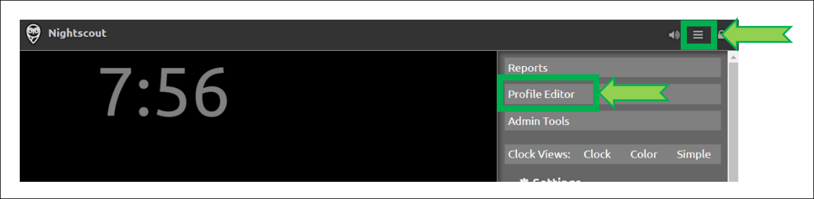

# Railway Nightscout

Method 1: using the Railway button

<span style="font-size:smaller;">**APPLIES TO:**</span> 

</br>

!!!info "Too complicated? Not what you're looking for? Consider a hosted Nightscout service! Check for easier solutions [here](../../#nightscout-as-a-service)."  
<span style="font-size:larger;">Interested in building a Nightscout DIY site?  Make sure you **read and understand [this](/#how-much-does-it-cost)** before starting.</span>

</br>

**Pros**:  

> The developer plan allows you to run Nightscout [for free](https://docs.railway.app/reference/plans#developer-plan-offering)  
> Migration process is really simple  
> You can use a local Mongo database, cost is $0.000231 / GB / Minute  
> The developer [plan](https://docs.railway.app/reference/plans) is meant for hobbyist workloads  

**Cons**:  

>Using the M0 [MongoDB Atlas](../../mongodb/atlas/) database  
>Railway network model generates missing data issues with some follower apps and devices

</br>

## Set up a new Nightscout

### Create your Railway and GitHub accounts from a computer.

!!!note  
    Do not change device/computer/browser during the setup process!  
    If you have unexpected issues when creating your site, restart with another browser.

</br>

### Step 1: Create a GitHub account

</br>

!!! warning "Already have a GitHub account?"  
    [Delete the cgm-remote-monitor fork](../../../nightscout/github/#delete-your-own-fork-of-cgm-remote-monitor) from your GitHub (if present) before proceeding.

If you don't have a GitHub account follow [**this link**](../../../nightscout/github/#create-a-github-account) to create one and come back.

</br>

### Step 2: Create a Railway account

a) Open [Railway](https://railway.app) in a new browser tab and click `login`. Login with GitHub.


</br>

b) If the following screen shows-up, select `Authorize Railway App`.


</br>

c) Click on `Please agree to the new terms to keep on using Railway`.


</br>

d) Scroll down and click `I agree with Railway's Terms of Service`.


</br>

e) Scroll down and click `I will not deploy any of that`.


</br>

f) You should now see this. You've created your Railway account.  
If it still shows 200 hours, refresh your browser page.


</br>

g) You need to use Nightscout for more than 500 hours per month: upgrade your account to a Developer plan. Click on the `Starter Plan` information and select `Remove Resource Limits`.


</br>

Enter your credit card information and select `Subscribe to a Developer Plan`.


Your card will be billed 1$ that will be refund immediately. Bank fees won't be refund.

</br>

!!!note "One-off purchase"  
      
      
    If you are reluctant to leave a billing method to Railway, you can **opt for a one-off 5$ purchase guaranteeing you access to a Developer plan** until this credit will be used (which is also an insurance against seeing your site stop unexpectedly).  
    No billing will occur after the initial credits are fully used. They will transfer month to month with no known limit in time.

</br>

### Step 3: Create your database

- #### You can reuse your existing MongDB Atlas database.    

Migrating from Heroku? [Edit your Heroku site variables](../../heroku/new_user#editing-config-vars-in-heroku) and copy the `MONGODB_URI` or `MONGO_CONNECTION` variable.  
    Lost your string? [Recover it](../../../troubleshoot/atlas/#recover-your-connection-string) from MongoDB Atlas.

- #### You can create a new MongoDB Atlas database.

To create a new MongoDB database follow [these instructions](../../mongodb/atlas/#create-an-atlas-database) and come back with your `MONGODB_URI` connection string.  
The Atlas database size is limited to 512MiB of data and is free to try. This might evolve in the future.  
When the MongoDB Atlas database is full your Nightscout site will crash.

- #### You can create a new Railway Mongo database.

!!!warning "Costs"  
    Adding a Railway Mongo database will not fit forever in 5$ per month.  
    If you don't keep its dimension very small (<200MB) you will most probably be charged for it.  
    A good database is important for your Nightscout site reliability.

a) Click `New Project` from your Dashboard screen (top right).


</br>

b) Click  `Provision MongoDB`


</br>

c) Select your new MongoDB project.


</br>

d) Go to the `Connect` page.


</br>

e) Move the mouse to the end of the line showing the `Mongo Connection URL` and click the copy icon.


</br>

!!!warning "This is an important information"

Now that you have **copied** the resulting `MONGODB_URI` string, keep it in a **safe place**, you will need it later.

</br>

### Step 4: Deploy cgm-remote-monitor

</br>

a) Click on the `Deploy on Railway` button below:

[](https://railway.app/new/template/6v8Ejj)

*Note: this is a temporary template until the community finds a way to get it owned by Nightscout and not only a single user.  
It doesn't include any referral code.*

</br>

b) If you see this screen, select `Connect GitHub to Deploy`.


Then select `Authorize Railway App`.


</br>

c) Click `Configure`


</br>

d) Click `Install & Authorize`


</br>

e) You will then see this page, scroll down to define the [required variables](../../../nightscout/setup_variables/#required-variables) for creating your Nightscout site.


</br>

f) Mind if you see this you will need to [delete the`cgm-remote-monitor` fork in GitHub](../../../nightscout/github/#delete-your-own-fork-of-cgm-remote-monitor) and retry `Deploy` from **a)** afterwards.


</br>

g) Setup your Nightscout core variables.

!!!note "Migrating from Heroku"  
    If you're migrating your project from Heroku, [display all variables in Heroku](../../heroku/new_user/#editing-config-vars-in-heroku) and copy all those with a value into Railway.  
    See below how to add variables in Railway but use your Heroku variables values.

`API_SECRET` will be your Nightscout site password, it needs to be at least 12 characters long and you should **NOT use spaces** if you use @ or ! symbols remember you will probably need to express them using [Percent encoding](https://en.wikipedia.org/wiki/Percent-encoding#Percent-encoding_reserved_characters) in your uploader and downloader apps. If you're not sure on how to do this, it is recommended to use only letters (uppercase + lowercase) and digits.

!!!warning "The API_SECRET is the **main password allowing full access to your Nightscout site**. Make sure it's reasonably secure (mix uppercase and lowercase letters, plus digits) and **do no not share it publicly**. If you think you exposed it by mistake, it is recommended that you **change it**."


h) At **Step 3** you created your database and came back with a MONGODB_URI string. Time has come to use it here.  


</br>

##### Dexcom Bridge

i) If you use [Dexcom `bridge`](../../../troubleshoot/dexcom_bridge/) you need to configure these two variables with your Dexcom credentials:


If you're using Dexcom Share in the US you should put **US**, in **any other case it must be EU**.  
If you don't see it proposed at this point you'll need to **browse the list below to find it and modify it**.


**Remember to add `bridge` at the end of the `enable` variable in the list below.**

!!!info "MOST COMMON ERRORS"
    The most common error on initial Nightscout setups is that people incorrectly use an old account or an old password. To test your username and password, go to Dexcom's Clarity page (check [here for USA accounts](https://clarity.dexcom.com) and [here for the others](https://clarity.dexcom.eu)) and try logging in to your Dexcom account. If your account info isn't valid, or you don't see any data in your Clarity account... you need to figure out your actual credentials before moving ahead. See [here](../../../troubleshoot/dexcom_bridge/) for troubleshooting tips and information on your Dexcom account.

!!! note "Password"
    *Some people have had problems with their bridge connecting when their Dexcom passwords are entirely numeric. If you have connection issues in that case, try changing your password to something with a mix of numbers and letters.*

!!! info
    You need to have at least one follower to use Dexcom Share. See [here](../../../uploader/setup/#dexcom).

</br>

j) Many optional variables are already setup for you, open the caret to see them and eventually modify them (**recommended**).


</br>

k) Select the units you’re using in `DISPLAY_UNITS` acceptable choices are `mg/dl` or `mmol/L` (or just `mmol`).


</br>

l) You can update the alarms values. See [here](../../../nightscout/setup_variables/#alarms) for the meaning of each one.


</br>

m) If you want to ensure that ONLY someone with permission to view your site (e.g., a token or the `API_SECRET`) is able to view the data, you should configure the [`AUTH_DEFAULT_ROLES`](../setup_variables/#auth_default_roles) variable in as `denied`.  
If you want your site to be visible to anybody leave it as `readable`.


</br>

n) A common list of [`enable`](../../../nightscout/setup_variables/#enable) variables is predefined, you can change them if you know why.  
It's recommended that you leave them like this for now.

Just remember to add `bridge` at the end if your get your BG values from Dexcom Share.


</br>

o) You can modify the variables values, check the [documentation](../../../nightscout/setup_variables) for the meaning of each one.  
Make sure you don't make typo errors, some will crash your site (like for example `LANGUAGE` value in upercase).

</br>

p) You can now `Deploy`, and wait until it is complete.


If you see this message, deploy didn't complete, let's fix this manually.


p1)  Select `Settings` and scroll down to `Service`.  
Disconnect your `Source Repo` with the cross at the end of the line.


p2) Confirm `Disconnect`.


</br>

p3) Select `Connect Repo`.


You should be able to select your GitHub `cgm-remote-monitor` repository.


Your Railway app will now automatically deploy.

</br>

q) You can see your new Nightscout site name in the deployment tab of your project. Click on the name to open Nightscout.  
Click on the link to open it.

!!!info "Change Railway site name"  
    You should [change your Railway site name](#change-your-railway-nightscout-site-name) now in order to make it easier to remember. **Recommended**.  
    You can also do this later, before setting your uploaders.


</br>

r) Your Nightscout site should open and direct you to a new profile creation.


</br>

s) Setup your `Time zone` and eventually all other fields. Do not leave any fields empty. If you don't know which value to use, just use the default value. You can change these values later at any time.


</br>

t) Browse down to `Authentication status` and click `Authenticate`. Enter your API secret. Click `Update`.


</br>

u) Click `Save`.


</br>

v) If the following pop-up shows up click `OK`, and check status (upper right of the window).


</br>

w) If you need to modify your profile after this, authenticate with the lock icon (top right of the page): enter your API secret. Then click on the hamburger menu and select `Profile Editor`.



</br>

!!!warning "Privacy warning"
    Anyone with access to the URL of your Nightscout site, can view your BG and run reports of your data. It it strongly recommended that you enable [security](../../../nightscout/security) to your site once you're done with the setup.  

</br>

x) Dexcom Share users should see data flowing in after some minutes.
xDrip+ users (including Medtronic [CareLink followers](../../../uploader/uploaders/#medtronic)) should setup the uploader as shown [**here**](../../../uploader/setup/#xdrip).
xDrip4iOS users [here](https://xdrip4ios.readthedocs.io/en/latest/connect/cgm/#nightscout-upload).
[AAPS](https://androidaps.readthedocs.io/en/latest/Configuration/Preferences.html#nsclient) and [Loop](https://loopkit.github.io/loopdocs/operation/loop-settings/services/): consult the relative documentation.


</br>

## Change your Railway Nightscout site name

Railways automatically makes a name when creating your new site. It is rather difficult to remember.

You can change the site name but need to keep the `.up.railway.app` domain.

1. Select your Nightscout app

2. Go in `Settings`

3. In `Domains` go to the end of line and click the edit icon

4. Write your new name and check it's available

   Click `Update`

   Your Nightscout URL will now be `https://`*yoursitename*`.up.railway.app`


</br>

Change all your [uploaders](../../../uploader/setup/) and [follower](../../../nightscout/downloaders/) devices to reflect the new URL once verified correct functioning of your Nightscout site.

</br>

## Migrate your MongoDB Atlas database to Railway

!!!warning "Not an easy operation"  
    This is not an easy operation and requires command line instructions using a computer.  
    You can have a trusted person help you perform it, if you can provide both MongoDB Atlas and Railway MongoDB connection strings.

a) Dump your Atlas database

- Follow [these instructions](../../mongodb/atlas/#backup-your-database).

- Make sure you renamed your exported database folder to `test` as this is the default database name in Railway.

b) Copy your Railway database connection string

1. Select your MongoDB database
2. Click on `Connect`
3. Click on the Copy icon


c) Rename the database dump folder (example for Windows below) to `test` (default)


</br>

d) Import your Atlas database in Railway

- Open a command line utility (CMD, Terminal, ...) and make your way to the utility folder (if you don't want to include it in your system path). For example in Windows 64bits it's in `C:\Program Files\MongoDB\Tools\100\bin`.

Type a new command starting with: `mongorestore --uri` followed by the database string you copied above in **b)3.**, run it.


e) Wait until the import completes. You will see a line like this before returning to the command prompt.

```
2022-09-11T09:49:35.331+0200    456003 document(s) restored successfully. 0 document(s) failed to restore.
```

The number of documents will be different but the rest should be identical.

You have completed database restore.

</br>

If you're migrating your database, make sure to [update](#editing-variables-in-railway) the `MONGODB_URI` variable string to the new URI as copied in **b)3.**.  
Refresh your Nightscout browser once deployment completes view to verify data has been imported correctly.

</br>

## Editing Variables in Railway

</br>

#### Method 1 - Web interface

This is recommended when you only need to edit or add few variables.

a) Open [Railway](https://railway.app) and click `login`. Login with GitHub.


</br>

b) Select your Nightscout project.


</br>

c) Select your web app.


</br>

d) Click on `Variables`.


</br>

e) You can perform various operations on your variables:

1. Add a new variable with `+ New Variable`
2. View the variable value with `Show Value`
3. Edit or delete the variable or its value with the line end menu


</br>

Note that each variable modification will redeploy your project.

</br>

#### Method 2 - Raw Editor

This is recommended when you must perform lots of changes to avoid multiple project redeploys.

a) Open [Railway](https://railway.app) and click `login`. Login with GitHub.


</br>

b) Select your Nightscout project.


</br>

c) Select your web app.


</br>

d) Click on `Variables`.


</br>

e) Click on `RAW Editor` top right


</br>

f) You can access all your variables in a text editor, each line contains the variable name, the sign `=` then its corresponding value.

`VARIABLE=value`

Perform all your changes taking care of uppercase and lowercase information and click `Update Variables` when finished.


</br>

Once saved your project will redeploy.  
If deploy fails, check your modifications...

</br>
