# Building Nightscout on Raspberry Pi

## What You'll Need

Quick list of what you'll need for this set up:

* A compatible CGM
* Raspberry Pi 3B, 3B+, 4, or 5 (Anything below 3 does not work. Also, make sure to get the "B" version and not "A")
* Power cable for Raspberry Pi
* Keyboard (You don't actually need a mouse for the Raspberry Pi)
* A separate computer w/ mouse and keyboard (can swap keyboard back and forth if you do not have a second one)
* Micro SD card (Recommend at least 16GB)
* Micro SD card reader / adapter
* Monitor w/ power and HDMI cables (NOTE: The Raspberry 4 and 5 use micro HDMI, so you will need to ensure you have an adapter for that)
* Cloudflare account 
* A GitHub account 
* A Domain Name (Using DigitalPlat)

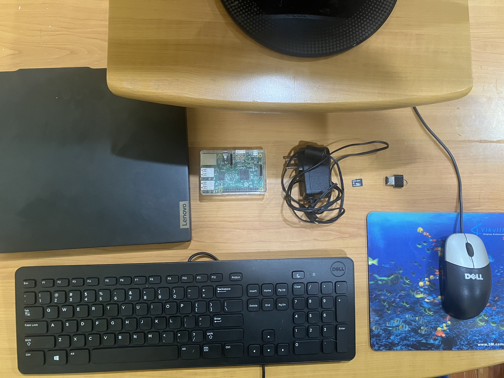

Unfortunately Raspberry Pis have become more expensive in recent years. However, they are still relatively cheap devices for their form factor and specs. 
You can pick up a Pi 5 kit for $160 and a Pi 4 kit for $120. Not cheap in any way, but these are kits that come with all you need. Power cable, micro SD card with an adapter, proper micro HDMI adapter, and also a nice case too.

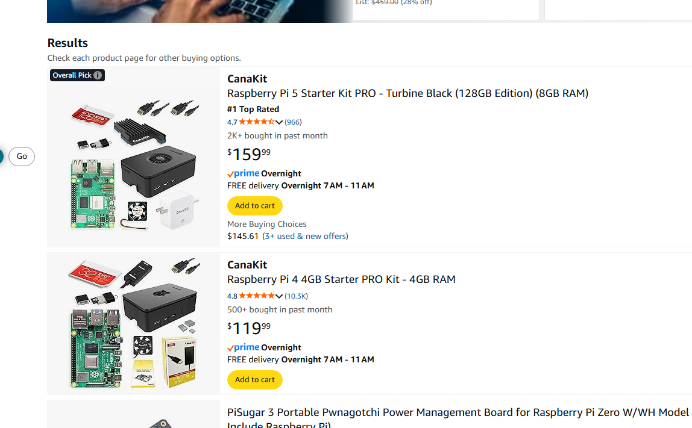

You can also go the cheaper route and pick up a Pi 3B for around $20 on ebay. However, you'll still need buy everything else separately including the power supply. 

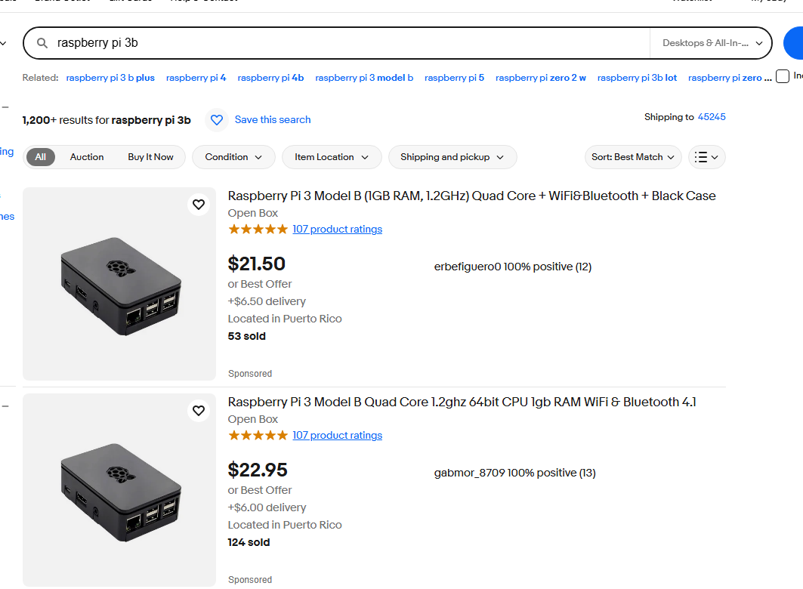

You'll also need to buy a domain as well, but I will get into that later.
## Raspberry Pi Imager

Once you have everything, take both your micro sd card and sd card reader and plug it into your computer. (NOT plugged into your raspberry pi) Next you'll need to install the Raspberry Pi Imager. Link [here](https://www.raspberrypi.com/software/)
One thing to note is that this setup can be done on Windows, Linux or Mac. Raspberry Pi has imaging software for each OS. Once downloaded, open the imager up and click on `CHOOSE DEVICE`. Depending on which Pi you purchased, you'll need to choose the corresponding device. So for 3 pick 3 and so on. For this tutorial I will be using a Raspberry Pi 3b. The instructions should be the same regardless of which version of the Raspberry Pi you have. If there are unique instructions for a certain version I will mention it.   

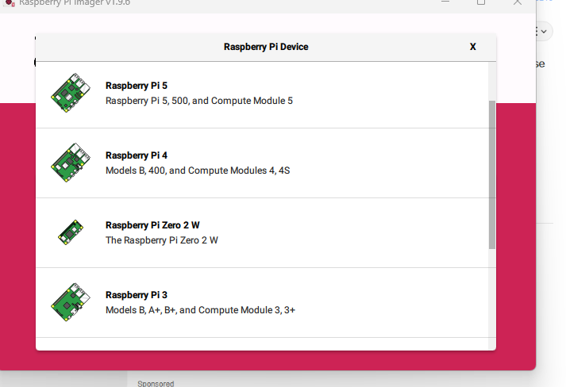

Once that is selected, click on the `CHOOSE OS` option. Scroll down a bit and select `Raspberry Pi OS (other)`. Then select `Raspberry Pi OS Lite (64-bit)`. Do NOT select the 32 bit version. That will not work.

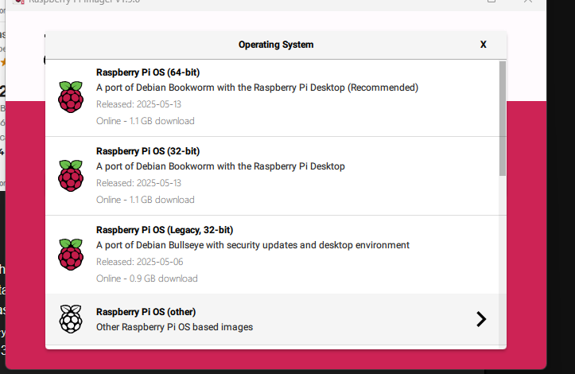
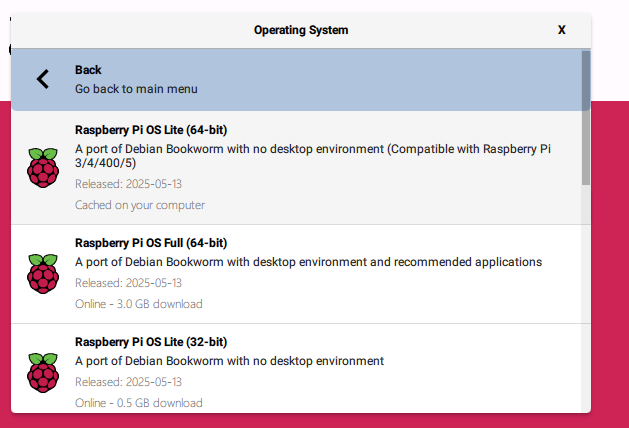

Finally, click on `CHOOSE STORAGE` and select your micro sd card, if it's not showing up make sure you've plugged it into your computer. If multiple drives are showing, double check which card is associated with which drive letter. You do not want to pick the wrong one as it will delete and overwrite all your data. In Windows you can verify this by opening up the File Explorer and click on `This PC`. This will show you all available drives and you can view contents of each one to determine which one is blank and for the Pi:

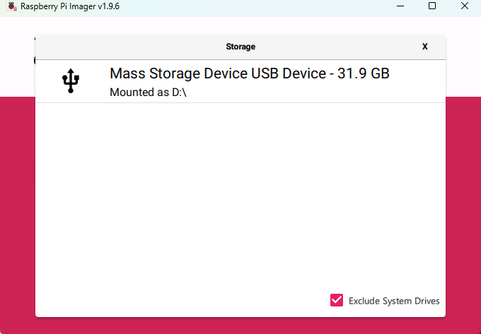
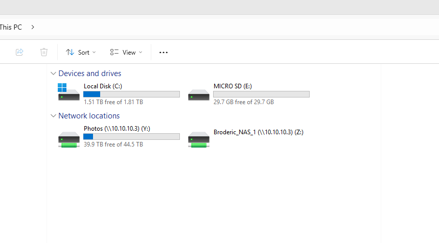

Once you've selected the proper drive, click on `NEXT`. From this pop up, select `EDIT SETTINGS` 

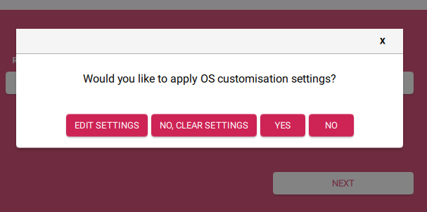

On the next screen you can ignore the first option, `Set hostname`. The second option, check `Set username and password`. For username use `nightscout` and a password with at least 8 characters. Very important to remember this login info. 

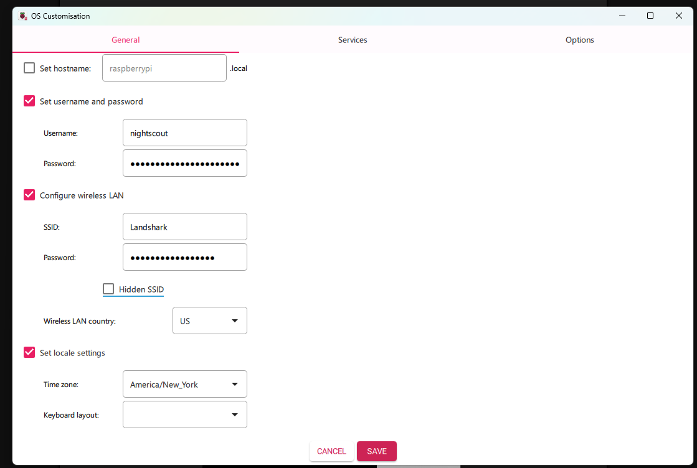

Also check off `Configure wireless LAN`. For SSID, put in your WiFi name. You can find your WiFi name in Windows by going to the bottom right corner and clicking on the Network and Sound icon, and then the arrow next to the WiFi icon. 

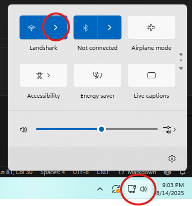

From there it should show your available Wifi networks and if you're connected over Wifi:

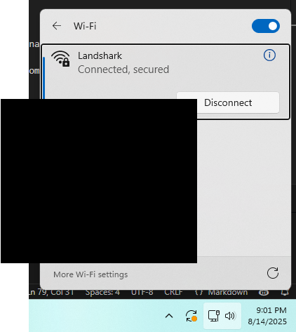

Also select `Set locale settings` and choose your timezone. And finally, there is one last setting to set. Click the `Services` tab and check off `Enable SSH` and select the `Use password authentication` radio button:

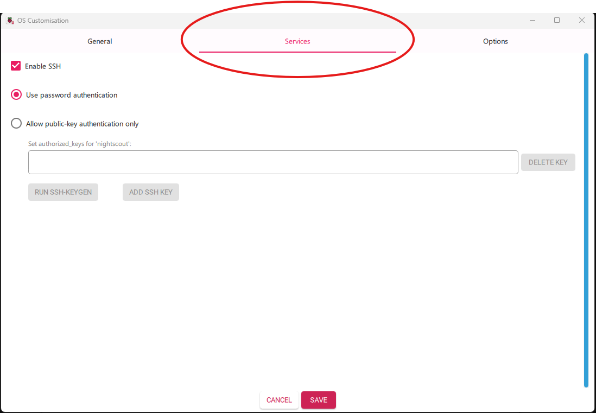

From there you can click on `SAVE` at the bottom. And then click on `YES`. Click on `YES` again for the pop up stating that "All existing data will be erased". 

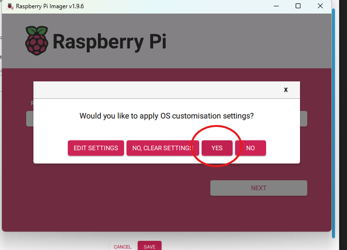

You should now see the Imager writing to the SD card:

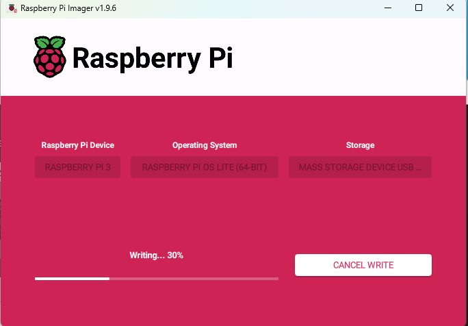

Should take anywhere around 5 - 20 minutes. Just depends on the speed of your computer and sd card adapter / usb port. You should see this popup after the Imager is done writing to the SD card:

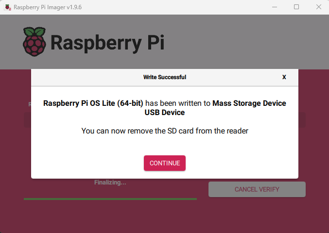

Can click on continue. 

## Setting Up The Raspberry Pi

After you're done imaging the SD card, take the adapter out of the computer and SD card out of the adapter. Then place the SD card into the Pi. (Going forward I will be referring the Raspberry Pi as simply the "Pi"). Plug your HDMI and Keyboard into the Pi. And then finally the power cord. Make sure your monitor is on, and on the right output. You should then instantly see a rainbow pattern for just a sec, then text stating "Generating SSH keys", and then a reboot message. From there you'll see lots of text scrolling across the screen:

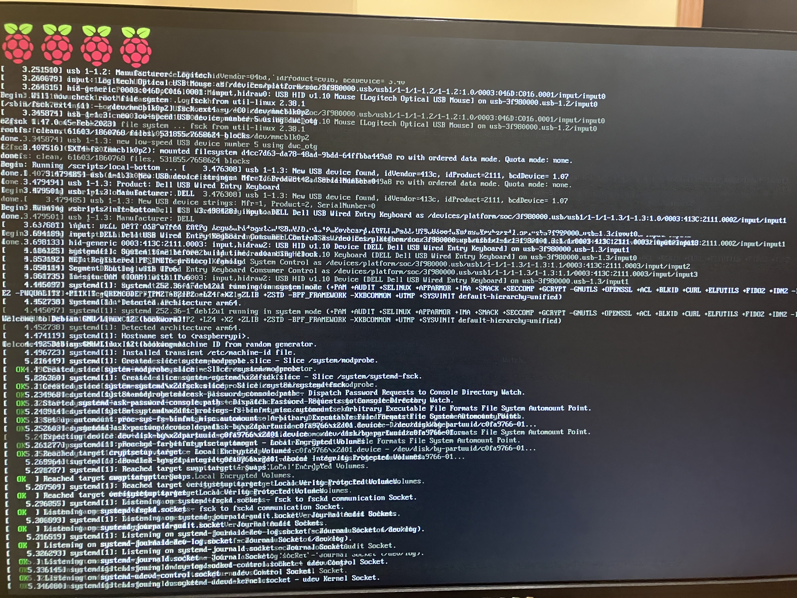

You'll also see the login screen for the first time, but this is false. You'll see that the IP starts with 127. This means it is still not done setting up just yet. Do not try to login until the login screen shows an IP that does not start with 127 or 169.

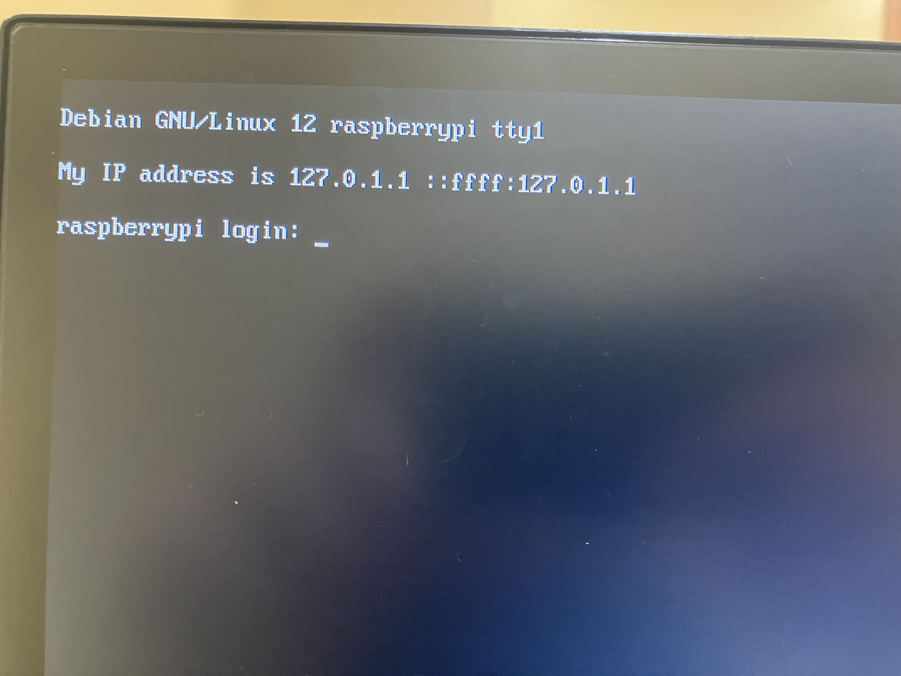

Once you see a non 127/169 IP, make note of the IP address assigned and go back to your other computer. If you've already logged in on the Pi itself, that is fine. And technically you can follow along directly using the Pi, but I do not recommend that. There will be some copying and pasting that will be much easier to do from a terminal. 

Back at your main computer, you are going to remote connect to the Pi over your own local network (LAN). Open up your preferred terminal. For windows hit `ctrl + r` and then type in `cmd`. For Mac, you can launch the terminal by hitting `Command + Space` and then typing in `terminal`. For Linux, you can figure that out yourself. Once you've opened your terminal, refer to the IP you made note of and type in: `ssh nightscout@insert_IP_address`. It should look something like this:
Don't worry if your IP does not start with 10. Most will start with 192.168. After you've typed that in, hit `Enter`. 

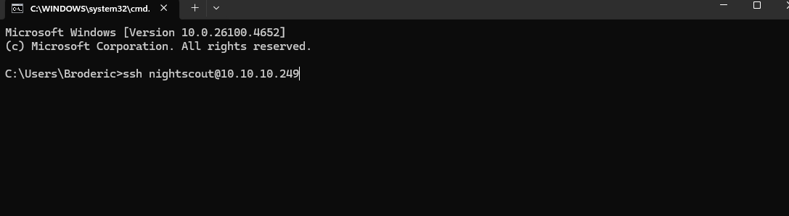

Text like this should now appear asking if you want to continue connecting, and if you want to fingerprint. Type in `yes` and hit `Enter`. 

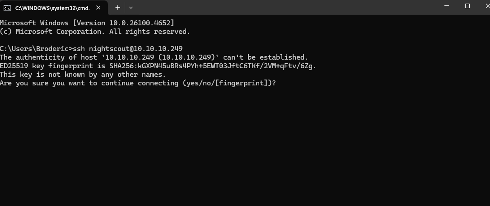

Next, type in the password you set earlier, and then you should be in! You can now remotely control your Pi from another computer!

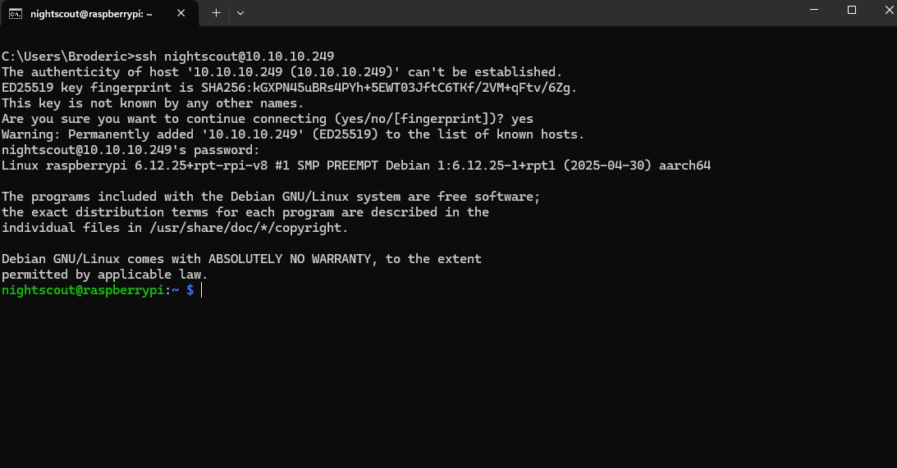

Give it a couple minutes before trying to connect again with the same command before (`ssh nightscout@insert_IP_address`). Pro tip, you can use the up and down arrows on your keyboard to run commands you've previously ran. No need to retype old commands each time. 

## Updates and Installing Docker

I've created a script for you that'll automatically update the OS and download Docker for you. It'll also download another script that you'll use to configure your Nightscout instance later on. 

You'll be using Docker to automatically download and install Nightscout and all its dependencies. Don't want to make this too technical, but you can think of Docker as a computer inside a computer. Basically, a virtual machine. (For the mega nerds out there, yes I know docker containers are not comparable to virtual machines, something something they share a kernel, whatever.) Docker calls these virtual machines "Containers". You'll see that I refer to them as "Docker Containers / Containers" most of the time later on in this post. 

Long story short, Docker allows for an easy install of Nightscout. When you deploy the Docker container, Docker does all the work of automatically installing / setting up Nightscout for you! The hardest part of this whole Nightscout set up is really installing docker and getting it running. To make things easy I've provided a script that will download and install Docker for you. The script will also download the Docker configuration file named `docker-compose.yaml` for you as well. 

The script you'll need to run for the Docker install is named `dockerinstall.sh`. Run this command to download and run the script automatically: 

`sudo curl -fsSL https://raw.githubusercontent.com/nightscout/nightscout.github.io/refs/heads/source/docs/_static/raspberry/dockerinstall.sh | sudo -E bash` 

(Also this is why I highly recommend NOT typing directly from the Pi itself. As you'll have to manually type web addresses like this yourself. Later on you'll need to copy a very very long string of random characters which will not be fun to manually type in. So please make a best effort to remote connect to the Pi from another machine.)

Once it's done updating and installing everything, it'll automatically reboot. You will have your remote session disconnected. 
Give it a couple minutes before trying to connect again with the same command before (`ssh nightscout@insert_IP_address`).

To confirm everything downloaded successfully, first run the command `ls`. This will confirm that your `docker-compose.yaml` script has been downloaded.

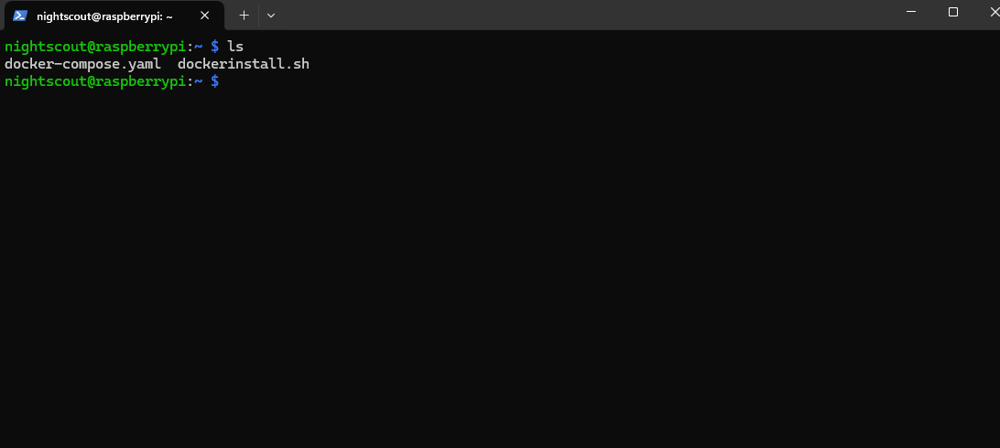

Next run `sudo docker ps`. You should see this output:

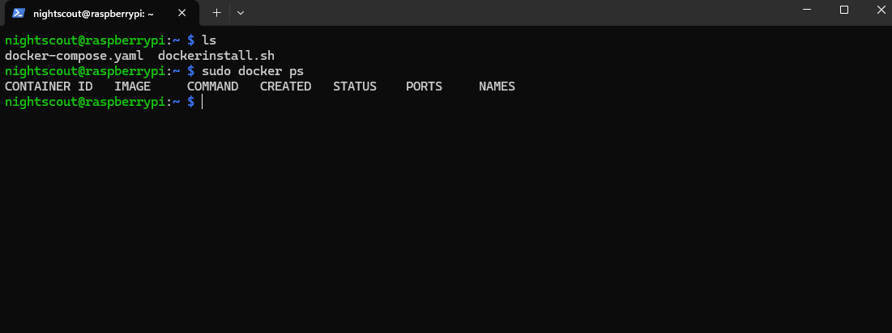

This confirms that Docker has been installed successfully.

Now, you'll need to edit this `docker-compose.yaml` file and put in the proper configuration settings. Type in the command `nano docker-compose.yaml` 
This command opens the file up in Nano, which is a commandline based text editor. You should see something like this after running the command:

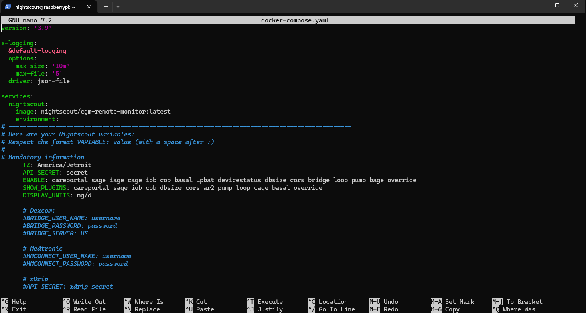

One thing to note when editing YAML files, NEVER use tabs. Do NOT use the tab key when editing the docker-compose.yaml file. Yaml does not allow for tabs in its config, only use spaces. If you accidentally press tab, just make sure to backspace it or just exit without saving. (`ctrl + x` and hit `n` to not save the edit)

Using the arrow keys, you can navigate up, down, left, and right. Use the down arrow key to go down to the TZ setting, where it says `America/Detroit`. If you live in the US Eastern timezone, then you do not have to change this. But if not, then you'll first need to use this [list](https://nodatime.org/TimeZones) to type in your corresponding timezone. You do not need to find the exact city you live in as not all cities are listed. What matters is the time offset to UTC time. For example, Eastern Daylight Time is -4/-5 UTC. Make sure to type in whatever is under the Zone ID column from the list. 

Next, go down one to `API_SECRET` and put in a password that is at least 12 characters in length. Make sure to note this down as this will be used to access the Nightscout site. Navigate down again to `DISPLAY_UNITS` and change this to `mmol` if that is what you use, otherwise leave that unchanged. 

Next, you'll need to put in your CGM credentials. Depending on what service you're using, you'll need to uncomment and put in the proper credentials. To uncomment, just remove the `#`'s from the line of text. For any CGM where you're using Dexcom Share, you'll use Dexcom. Medtronic, use Medtronic, and if using xDrip, use xDrip. [Here](https://nightscout.pro/en_us/knowledge-base/supported-devices-and-compatibility/) is the CGM list. 

NOTE: Anything with Jugguco or Diabox I am not going over. Those work by having the services upload to Nightscout, and thus no config options are needed inside the Nightscout setup. You'll need to look at their specific documentation on how to set it up.

Scrolling down some more, feel free to remove the #'s and uncomment these if you plan on connecting this with Loop. If you're not using Loop or another external pump, you can skip this.

For the official, full, in-depth docs regarding plugins and settings visit [here](https://github.com/nightscout/cgm-remote-monitor?tab=readme-ov-file#plugins).

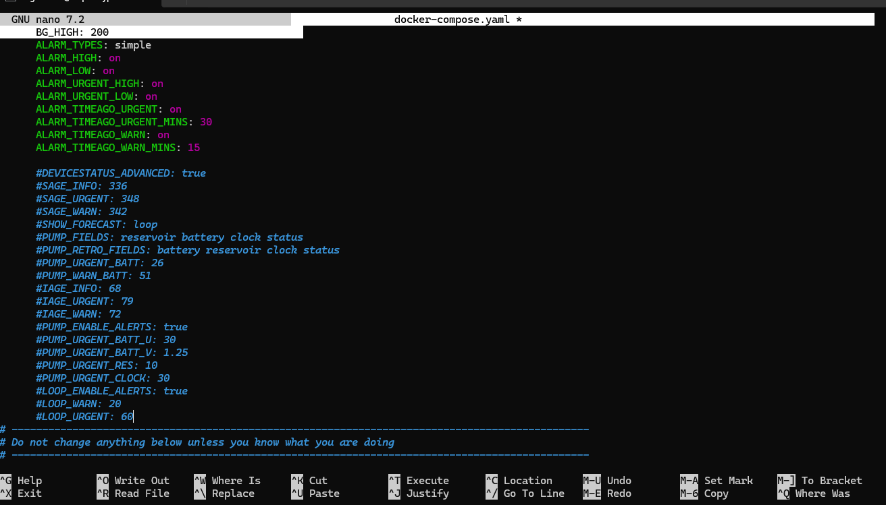

After everything is filled in, press `ctrl + o`, then hit `Enter` and then press `ctrl + x`. This will save the file and then exit. 

## Setting up Nightscout

Now it's finally time to run your Docker containers and start up Nightscout! You'll first run it with log output to ensure there are no errors. And then once you've confirmed everything is working, restart the containers with it running in the background.

To start the Docker containers with logging run `docker compose up` Once you've ran the command you should see something like this:

You'll see that two different images are being installed, with two separate containers eventually running. 
The first container is Nightscout, which is the container running the actual web services so you can actually visit and see the site from your web browser. The second container is the MongoDB container. MongoDB is the database that Nightscout uses, and this is where all your glucose readings will be stored. 
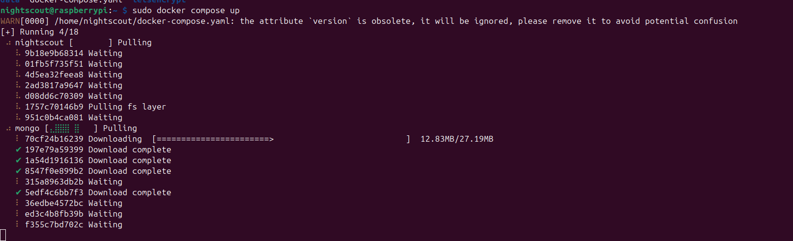

This is downloading the latest Nightscout and MongoDB images and then having it all installed and set up for you! Everything is done automatically, which is why Docker is so awesome! 

Once all images are done downloading, you'll stop seeing a bunch of text:

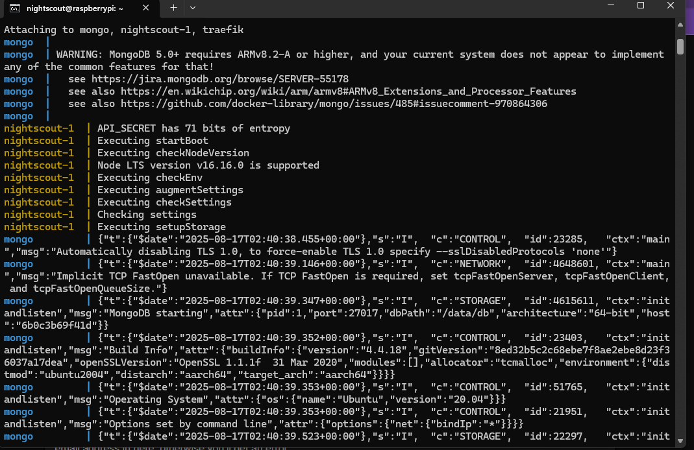

Eventually, you should start seeing text entries like this that start with *svg*

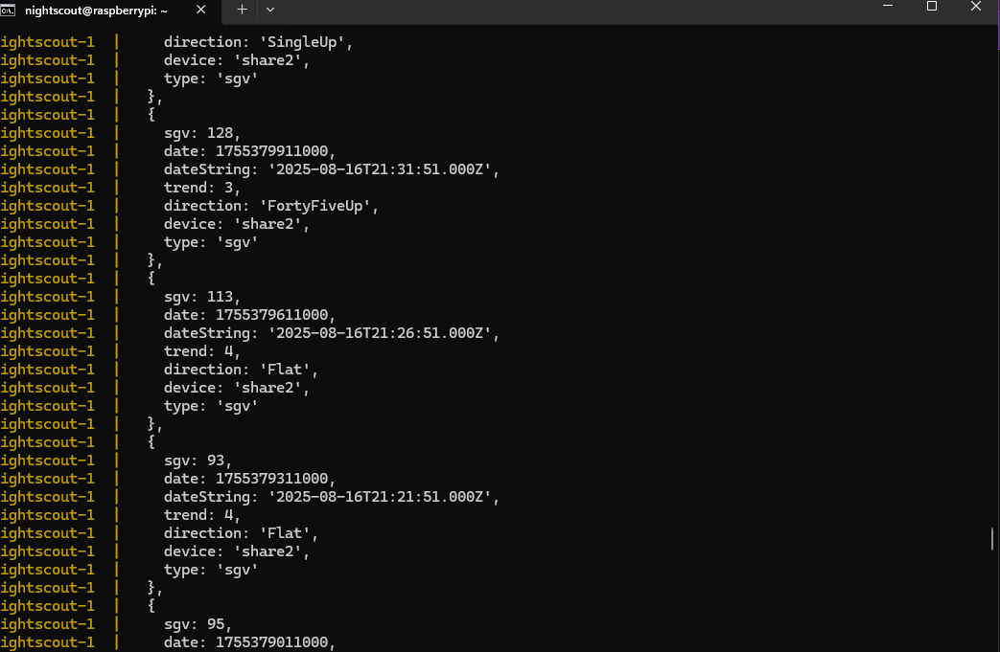

Now, it's time to visit your Nightscout site! In your web browser, from the URL bar, type in your Raspberry Pi's IP (The same IP you used to connect to the Pi remotely).  Example: `10.10.10.139`

You should then be taken to your Nightscout site with this popup:

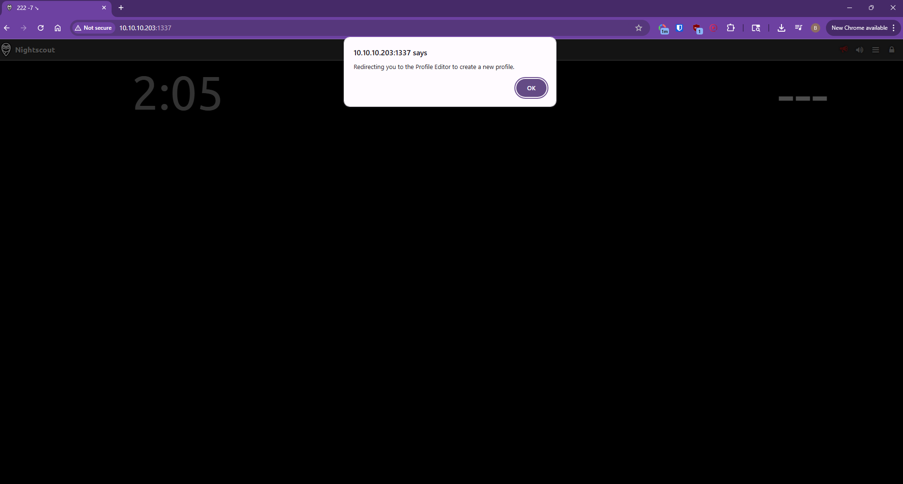

If you're unable to access your site and / or you're seeing errors, try first going back and re-reading previous steps to ensure you've followed everything correctly. To start troubleshooting you'll need to first stop the Docker container and Nightscout. So go back to your terminal where you have the remote session with your Pi, and press `ctrl + c`. Press that a couple times and your docker container should stop. Then you can either use the command `nano docker-compose.yaml` to view and edit, or if you just want to view the file, you can run the command `cat docker-compose.yaml`. Once you're done troubleshooting, you can restart the Nightscout docker container using the same command `sudo docker compose up`. 

Back to Nightscout.

Click `Ok` and then scroll to the bottom where there's a link at the bottom left labeled `(Authenticate)`, click it and put in the password you put in for you `API_SECRET` that is stored in your `docker-compose.yaml` file. Feel free to also check `Remember this device. (Do not enable this on public computers.)` Then click `Authenticate`. If you need to edit / take a look at the `docker-compose.yaml` file you'll need to stop your Docker container and view the file. Take a look at the instructions in the above paragraph to see how. 

Now scroll back up find the `Record valid from` field. You should see date and time options:

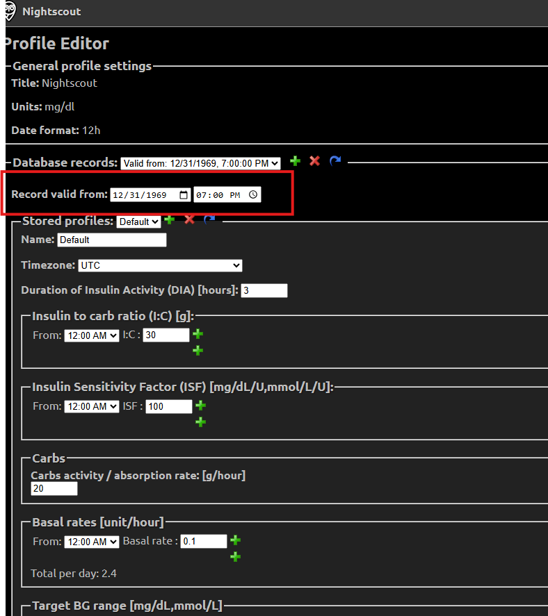

Don't use the date and time pickers. (The buttons on the right of each option box.) Just manually type in the date and time. You can do that by clicking each individual number and typing in what number you want in its place. Same goes for the AM / PM. Once that is changed, scroll back to the bottom and click `Save`. Then scroll back to the top and click the `X` at the top right. 

Tada!!! You should see your Nightscout site now!

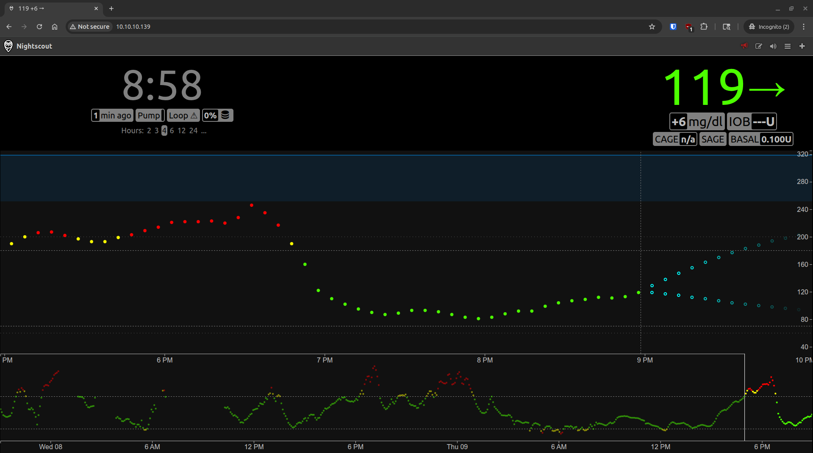

If you're able to see your site, but don't see any glucose entries from your CGM, double check that your username and password you added to your `docker-compose.yaml` file are correct. Also double check that you typed them in correctly, make sure there's no extra spacing between the field and the entry. If you're still having issues, feel free to email me at: nightscout@brz86.com

Now, you'll need to restart your Docker container so it runs in the background. Go back to your terminal session press `ctrl + c` wait for your docker container to stop. Then type `sudo docker compose up -d`. That `-d` option will have the docker container run in the background (detached mode), so your terminal is free for other commands. Now if you type `sudo docker ps` this should list your docker containers running! You should be able to see the site back online in your web browser. 

Now, for the next issue to solve. Currently the only way to access your Nightscout site is to be on the same local network as the Raspberry Pi. This is an issue because if you're not home, or you want someone to connect to the site outside your home, they can't. To solve this issue you'll be using something called a `Cloudflare Tunnel`. Basically you'll link your Nightscout site to Cloudflare and then when someone goes to visit your site they'll first be taken to Cloudflare and that'll redirect them to your Nightscout site. Best part is, it's free! Also super easy to set up. (Relatively speaking of course. Other option is doing a port forward / setting up a reverse proxy / VPN and also setting up DDNS / Static Public IP. Plus, Cloudflare tunnels work with CGNAT too.)

If you're unsure what Cloudflare is, don't worry! They are one of the largest Content Delivery Network companies. You can think of them as one of the Gatekeepers of the Internet. Long story short companies have issues with large / malicious / bot traffic. Cloudflare handles all of that for you so your site stays online. [Here's](https://www.cloudflare.com/case-studies/) a list of companies that use them. Cloudflare is a giant company that has a great reputation. I decided to use Cloudflare for this simply because of their tunnel feature and how easy it is to set up. But this tunnel will also protect your site from bots and other malicious network activity. (NOTE: That doesn't mean it'll protect against everything. If you've set up an easy to guess password on your Nightscout site, Cloudflare will not prevent a bad actor from logging into your site without your permission. Also if Nightscout happens to have any vulnerabilities, Cloudflare will not protect against that either.)

To set up this Cloudflare tunnel though, you'll first need a domain. This will be the URL you type in to visit your Nightscout site. Think like google.com

## Setting up a Domain
 
For the domain registrar I have decided to go with [DigitalPlat FreeDomain](https://domain.digitalplat.org/about/). It allows you to create one free domain with custom DNS servers. Most free services do not allow you to point your DNS servers to somewhere else. This is important as you will be using CloudFlare which requires you to point your domain to its DNS servers. 

To get a DigitalPlat Domain you'll need a GitHub account as well as an account for DigialPlat. First sign up for GitHub [here](https://github.com/signup?ref_cta=Sign+up&ref_loc=header+logged+out&ref_page=%2F&source=header-home).

Once you have your GitHub account, sign up for DigitalPlat [here](https://dash.domain.digitalplat.org/auth/register). Note that it's pretty picky with the field requirements, so make sure to closely read each one if you're see red messages underneath. Especially the phone one, which needs a dash between the country code and local phone number.

Once you're logged into your DigitalPlat account, you should see this page:

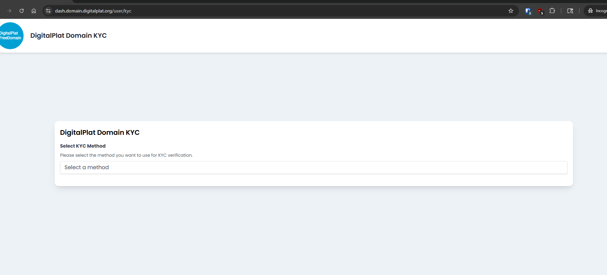

Select `GitHub OAuth` as your method and then click `Sign in with GitHub`. After putting in your GitHub creds, click on `Authorize EdwardLab`:

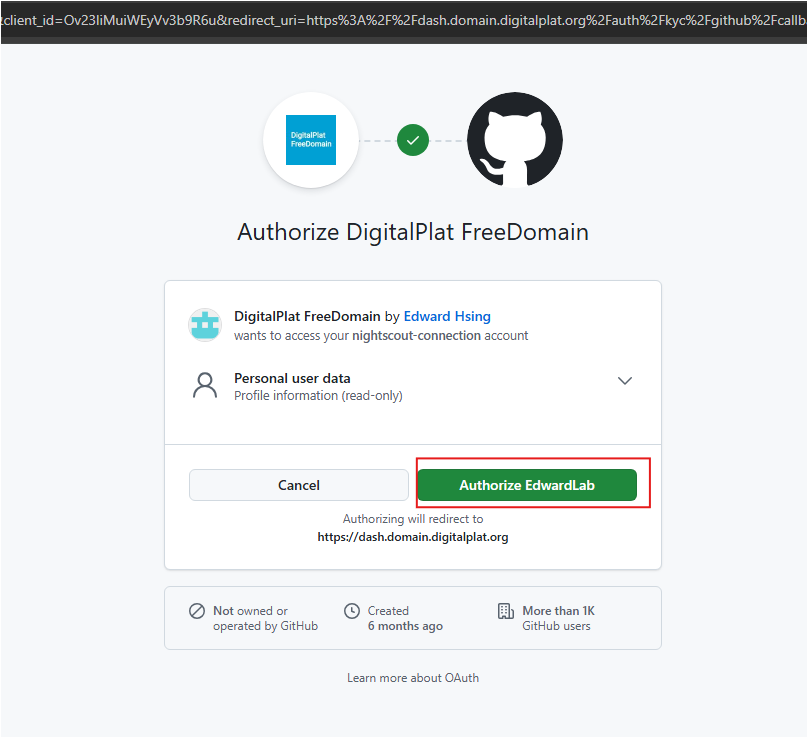

The site is a little glitchy with this process, so if you get some kind of error, just manually visit this [page](https://dash.domain.digitalplat.org/panel/main). If you don't see this page:

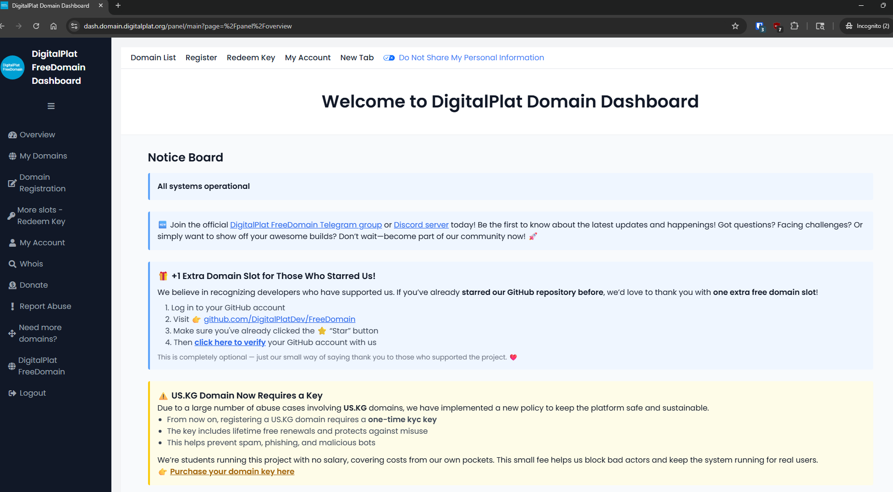

Then try linking your GitHub account again.

Once, at the main dashboard, click on `Domain Registration`, located at the left-side menu.

That should bring you to this screen:

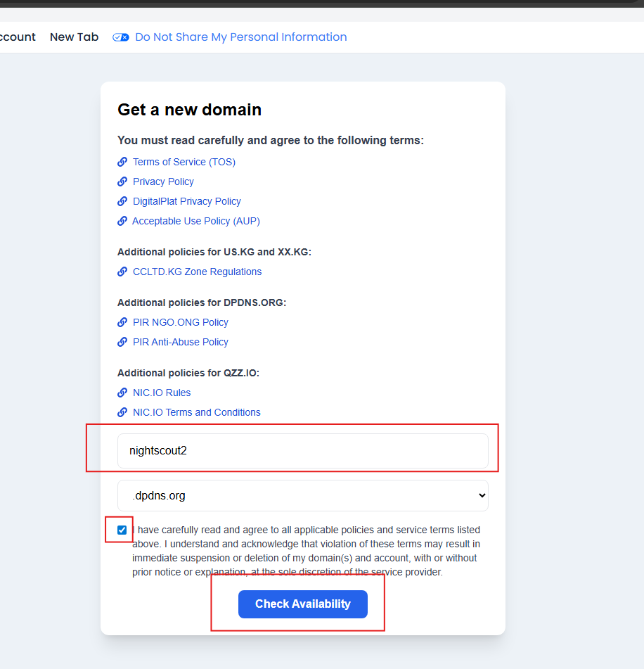

First, leave the domain at `.dpdns.org`. The other options use TLDs like `kg` and `io` that have a worse reputation. Your Nightscout site will probably be blocked at school / work, but using a .org domain gives you the best chances of not getting blocked. If you experience access issues at school / work, you'll have to request that the domain be unblocked.

Make sure to put in your custom subdomain. I chose `nightscout2` for mine. So my full domain will look like: `nightscout2.dpdns.org`. Also make sure to check off the acceptable use policy that you totally read. Then just click on `Check Availability`. If it's taken the site will let you know, otherwise you'll be taken to this page next:

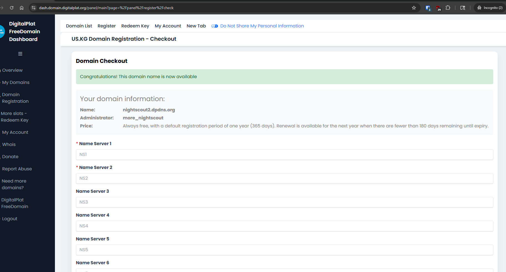

Now you'll need to set up CloudFlare before continuing. So just leave this webpage open while you set up CloudFlare in the next section.

## Setting Up Cloudflare

Head over to Cloudflare and [create an account](https://dash.cloudflare.com/sign-up). Once you've created your account, login and at account home, click on `Onboard a domain`, and then the `Domains` tab. Then enter in your domain and scroll down and hit `Continue`:

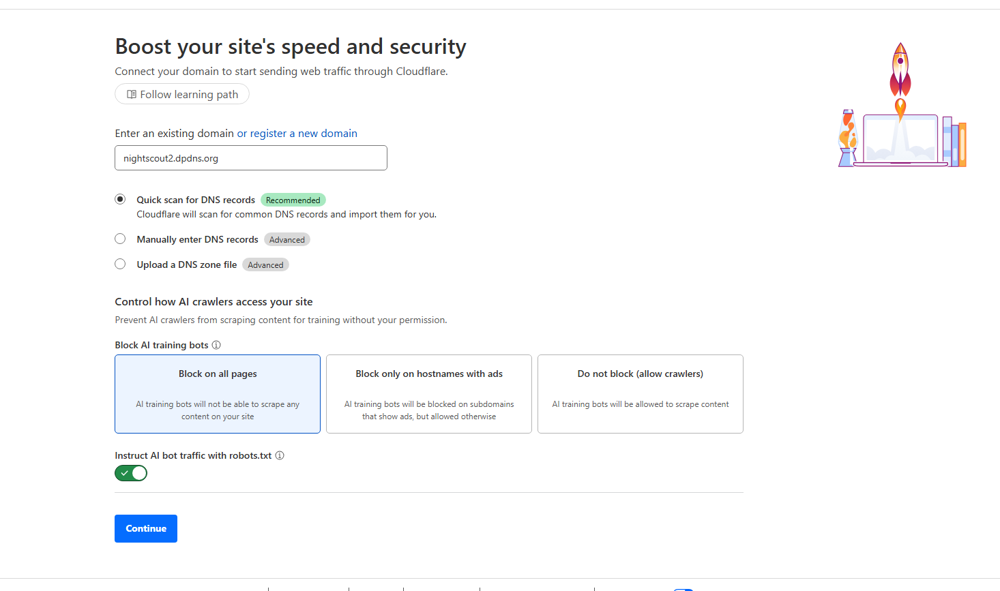

At the next section, select the `Free` panel by clicking `Select plan` underneath. Next, you'll be taken to the Review your DNS records section. Just scroll and click on `Continue to activation` at the bottom. (Ignore the DNS records warning, just click on "Confirm")

This is where you'll enter in your name servers for your DigitalPlat Domain. Copy both of these name servers and enter them into the DigitalPlat Domain setup.

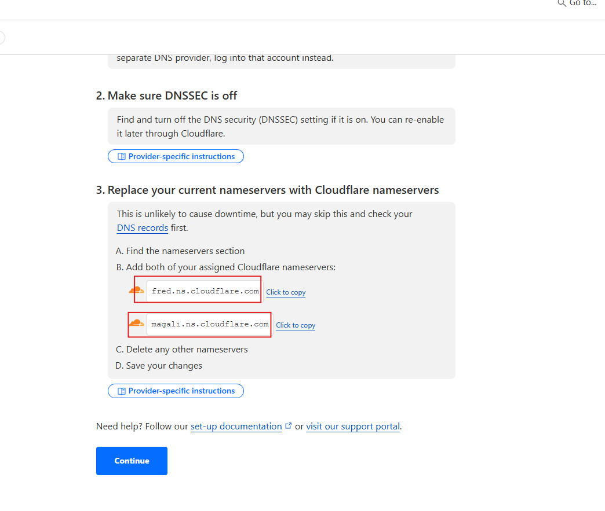
Paste them as your Name Servers on DigitalPlat:
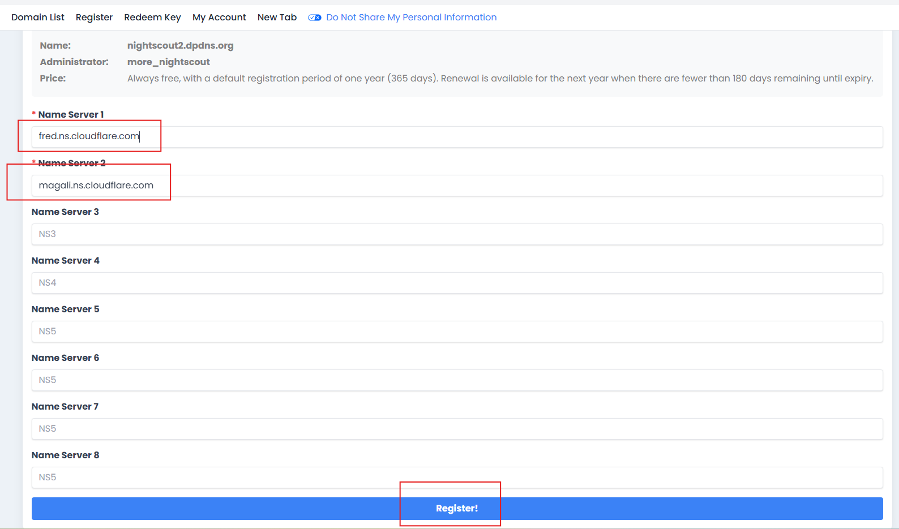
And click on `Register`. You see a message stating that your registration was successful.

Go back to your Cloudflare tab, and click on `Continue`. Now you just have to play the waiting game while your domain registrar updates your domain's nameservers. In my experience it usually takes ~10-30 minutes. But may take up to 24 hours. Once the domain has been updated, you should receive an email from Cloudflare. 

You should see something like this once your domain is ready:

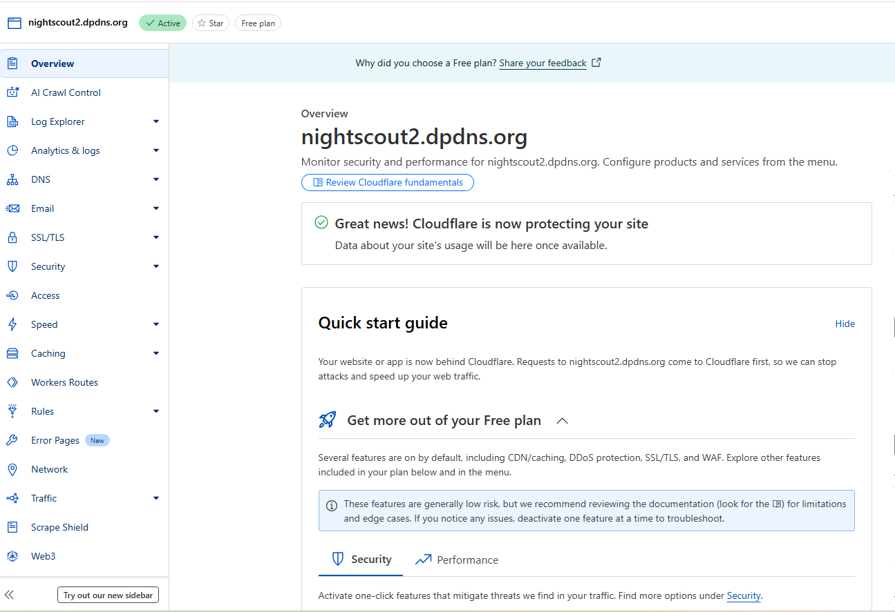

At `Account home`, you should see the domain status as `Active`:

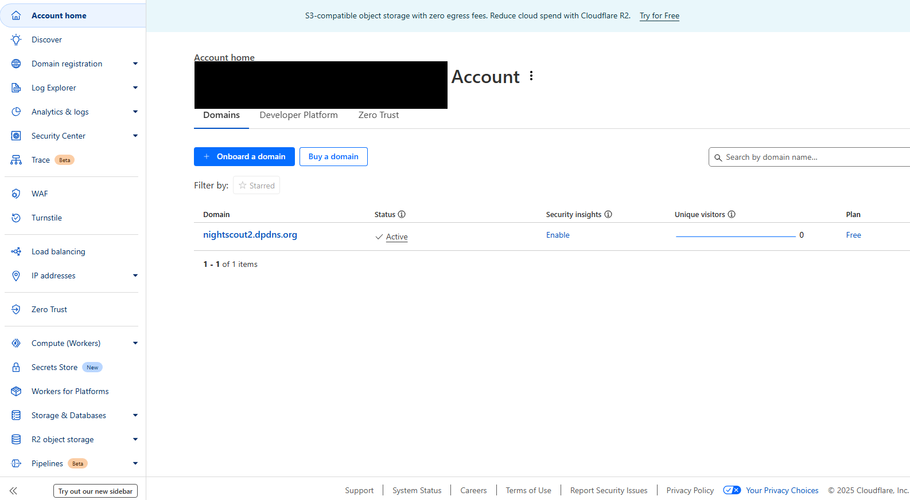  

From the panel to the left, click on `Zero Trust`. And then click on the arrow by `Networks` and click on `Tunnels`. Then click on `Create a tunnel`. Select `Cloudflared`. Name your tunnel whatever you want and click `Save tunnel`.

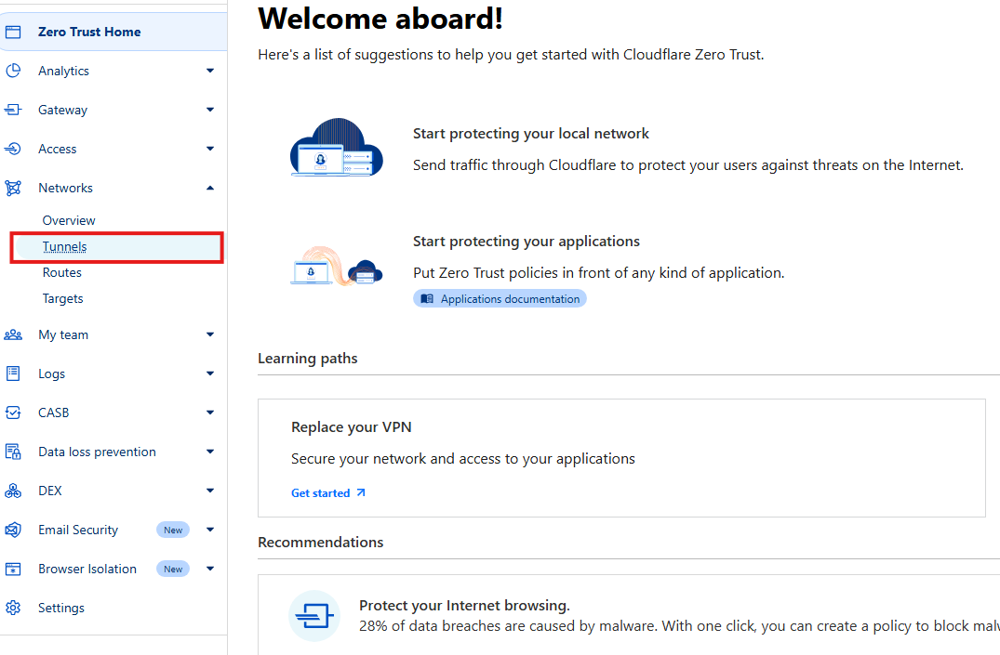

For the Configure section, select `Debian` and then select `64-bit`

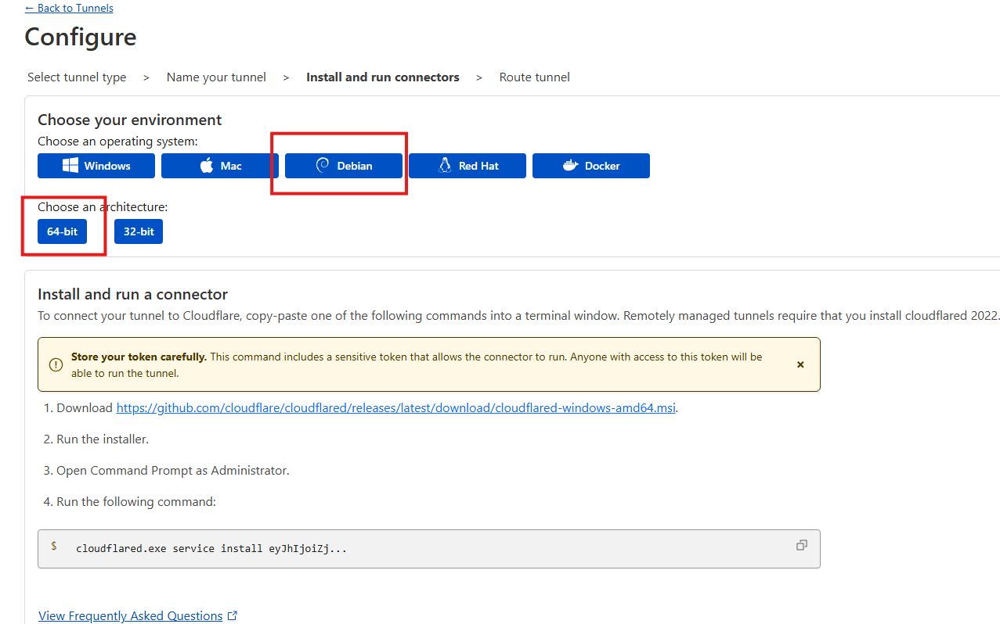

A script should appear, and you'll just need to copy it by clicking on the copy icon at the top right of the script:

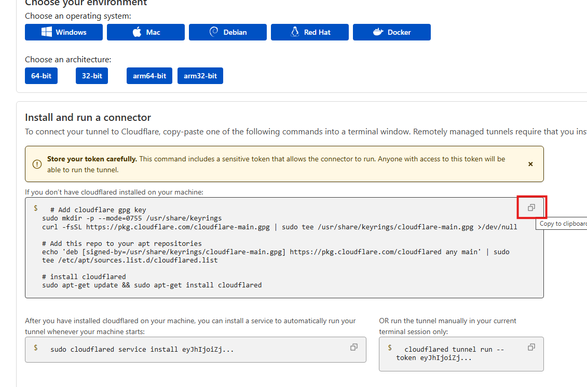

Once it's copied, go back to your remote session, and paste it in there, then hit enter. This should download and install the `cloudflared` service on your Pi. Now copy the second command and paste that into your remote session:

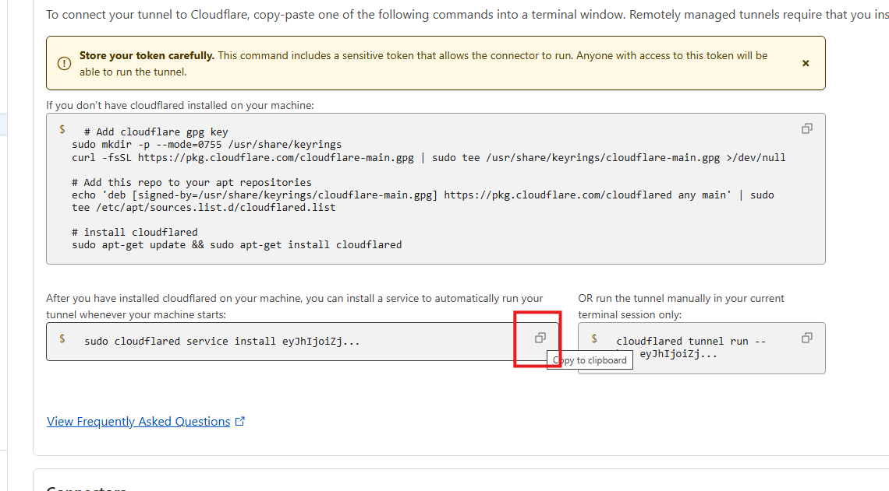

If it installs successfully you should see output stating "Linux service for cloudflared installed successfully". 

Go back to Cloudflare and scroll down and click `Next`. For the Route Traffic section, choose your domain under the `Domain` option. Then under `Service`, for `Type` select `HTTP` and then for `URL` put in `localhost:80`. Once you've filled those out, click on `Complete setup`.

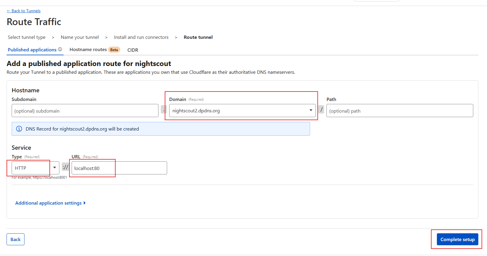

Wait a couple minutes and then go to your browser and type in the domain. If you get a gateway / 404 error, just give it more time. 

Eventually you should see your Nightscout site:

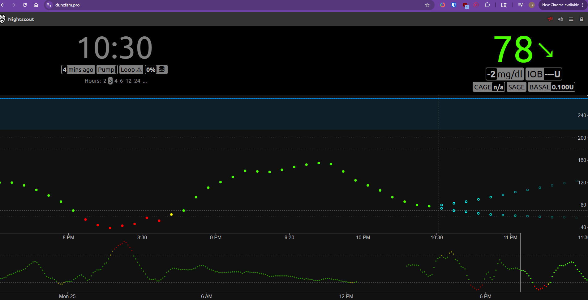

If all is working, congrats! If not, try going back to previous steps and confirming everything is working. Also remember to run Docker out of detached mode to see if there are any errors: `sudo docker compose up`. Remember to run this after shutting down the containers with `sudo docker compose down`. If you're still having issues, you can contact me at `nightscout@brz86.com`. 

One last thing to note with this setup, if your Pi shuts down at any point, when you start it back up everything should automatically start up again. This includes all your Docker containers as well as the Cloudflare tunnel. 

## Troubleshooting

Here is a basic troubleshooting checklist you can go through if you're having issues:

1. Is the Raspberry Pi is powered on?
2. Did the Pi boot properly? (Can verify by SSHing into the device or viewing from the monitor if you have the HDMI display plugged in)
3. Are the containers actually running? (`docker ps`). You should see them listed, if an empty table is listed, then they are not running. Run `docker-compose up -d` to start them back up.
4. Is your CloudFlare tunnel running? (`sudo systemctl status cloudflared`). You should the `Active:` field have `active (running)`. Also log into your cloudflare account in your browser and go to `Zero Trust Home` > `Networks` > `Tunnels`. The `Status` field should be `Healthy` for the domain.
5. Check Docker logs (`docker logs nightscout`) (`docker logs mongo`). Nightscout logs can give hints if your `docker-compose` was not filled out correctly. And the mongo logs can help troubleshoot issues with reading and writing glucose values to the database.
6. Does your Pi have a proper Internet connection? If your cloudflare tunnel says it's down, this could be a hint your Pi cannot connect to the Internet. Do a ping to a popular website (`ping google.com` or `ping 1.1.1.1`).
7. Does the device you're trying to connect to Nightscout to have a proper Internet connection? Try visiting another site to confirm.

## Updating

I do not suggest setting up any kind of automated updates as it is not necessary and is overkill. I recommend keeping tabs on the [CGM in the Cloud Facebook group](https://www.facebook.com/groups/cgminthecloud) for the latest news regarding Nightscout. If something urgent comes out like a security issue, then you can update. There are risks with an automated update system where the latest update could possibly break part of your setup. It's important to read through the change notes for each new version as your specific setup could be at risk of breaking from a newer version. You can view change logs [here](https://github.com/nightscout/cgm-remote-monitor/releases).

To update to the latest version just run `docker compose pull` and then `docker compose up -d`.

## Backups and Recovery 

This next section is optional, but highly recommended if you care about preserving your data long term. If you only care about real time glucose levels and don't really care about saving your records, then you can skip this section. 

I will go over two methods, an easy, but manual method, as well as a more difficult, but automated method. 

#### Manual Backups

For this I am going to be using software that is exclusive to Windows, Win32 Disk Imager. For Mac you can use The Disk Utility or the command line tool, `dd`. Linux can also use `dd`. Right now I will be only going over how to do this on Windows. 

Win32 Disk Imager allows an easy way to create an exact copy of your sd card. The main issue with Win32 Disk Imager is that it doesn't really have an official download site. I downloaded mine off of Sourceforge, but there are plenty of fake downloads that try to look legitimate. Sites like win32diskimager[.]org are fake sites that host malicious versions of Win32 Disk Imager. To make things simpler here, I've decided to upload the copy I've confirmed (confirmed with Virus Total hash: `a51c9fc75c9caa44df03502838f229a70d484963f54675c241799093a59d8874`) as safe. [Here](https://drive.google.com/file/d/1yw5w_cxbpFwU0yvMcX0FdB7bV4DQzksU/view?usp=sharing) is the download link.

Click the download icon at the top right. You'll be given a zip file. So once it's been downloaded, right click it and unzip the file, from there you should see a file named `win32diskimager-1.0.0-install.exe`. Double click on that. Once the program is running, insert the sd card from the Pi into your computer. If you have multiple removable drives inserted into your computer, you'll need to confirm the drive letter. You don't want to make a backup of the wrong drive. And more importantly, when you write to a drive, you do not want to write to the wrong drive either, as all data will be overwritten. 

On Windows, you can go to "This PC" and view all your available drives. Note the drive letter of the sd card. Back at the Win32 Disk Imager, under `Device` select the proper drive letter. Then click on the folder icon to the left the `Device` section. Choose a folder to save your backup, and then for the `File name:` create a name for your backup, and just make sure it ends in `.img`. Example: `nsbackup1.img`. Once that is done, go to the bottom and click on `Read`. This will create the file you specified, and once done, will be a backup that you can write to an sd card at anytime. Once written to the sd card, you just plug it back into the Pi, and all should be good. 

To write to the sd card, you'd just select one of your backups (ending in .img) and then select `Write`. Note this will overwrite whatever is on that card. Also, you need to be sure that the sd card you are writing to has at least the same amount or more storage than the original sd card. 

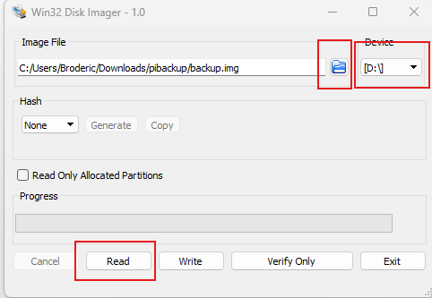

I recommend the following as your backup plan:

* Get at least one extra sd card that is the same size or greater than the card you currently use for your Pi.
* Do backups every month. 
* Every 3rd or 4th month, write your backup to the other sd card, and use that card as the one in your Pi. And from there just swap them back and forth. 
* If it's your first time doing a backup, I'd immediately write it to the other sd card and put that in the Pi. It's important to test your backups, because what good is having a backup if it doesn't work? I recommend swapping every 3 to 4 months also to test your backups. The reason for them to be so spread out is because writes to an sd card over time wear it down. You could just decide to never write to the backup until your primary goes out, but I think it is important to continue to test and use the backup. This will catch any mistakes made early on, instead of realizing that a bunch of your backups you have saved are useless. 

#### Automated Backups

One thing to note with this setup is that you're going to need to set up static IPs for whatever computer you use to host the file share. This is something I am not going to go over. But you can look this up yourself. I can't go over this really because there are simply too many different types of routers. And each router has settings that others don't. Unfortunately, depending on your home network setup, this may not be possible. Look for options that allow you to get into your router's admin settings page, and look for options like "static IP" or "IP reservations" or "DHCP Range". Setting your static IP on just the host machine is not enough, as your IP is still at risk of changing". You'll need to let your router know the specific device you want to have a static IP. Another way is to adjust the DHCP range, so your device is set to an IP not in the DHCP range, thus remaining static.

Again, I will be only showing this for Windows. But this is entirely possible on both Mac and Linux. You will just have to look up how to host a file share for those respective platforms. Also, DO NOT set this up on the Pi that is running Nightscout. A backup on the device itself is useless and not recommended. 

This backup technique can be used in combination with the above technique. In fact I recommend you do both. These backups technically backup different things. The above manual backup method, backups up your entire config, including all configs on your Pi. For this backup, if you were to lose your Nightscout / Pi setup. You would first have to install everything before doing the backup. Basically, you would need to make sure you have all your containers running first. 

To create this automated backup, you'll first want to create a new local Windows account that'll be tied to this new share you're about to create. If you already have a local account, or know how to work with using an online Microsoft account for file shares, feel free to skip, but this will simplify the process here. 

To create this local user, hit `ctlr + r` type in `cmd` and then hit `ctrl + shift + enter`. This should open up the command prompt with admin permissions, which are needed to create a new local account. Once command prompt is open, type in: `net user sharens yourpassword /add` then hit `enter`. You should see a message: "The command completed successfully."

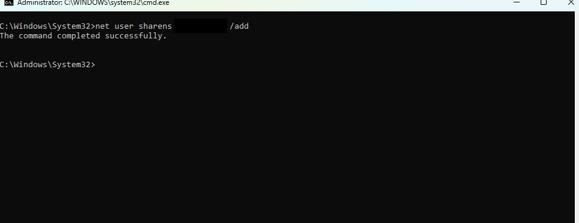

Then run the command `net user` to confirm the user is there.

If you want to hide this user from the login screen, run this command: `reg add "HKEY_LOCAL_MACHINE\Software\Microsoft\Windows NT\CurrentVersion\Winlogon\SpecialAccounts\Userlist" /v sharens /t REG_DWORD /d 0 /f`

Next, create a new folder and name it with no spaces. For mine I chose `NSBackup`. Right click on your folder and select `Properties` near the bottom and then select the `Sharing` tab. Then click on `Advanced Sharing`. Checkmark, `Share this folder`.  Then click on `Permissions`, then `Add...`, and type in the local user you just created. You should now see your local user under the list. Make sure to select your user from the list and then checkmark under the Allow column `Full Control`. Then click `Apply` and `OK`. And then `OK` again. Now go to the `Security` tab. Click `Advanced`. Click `Add`. Click `Select a principal`. Enter in the name of the same local Windows account. Check off `Full control`. Click `OK`. Click `Apply` and then `OK`. Finally, click `Close`.

You also need to make sure file discovery is enabled on your device. Open up file explorer, and visit the Network tab. If you see a bar at the top stating file sharing is turned off, click on it and select `Turn on network discovery and file sharing`

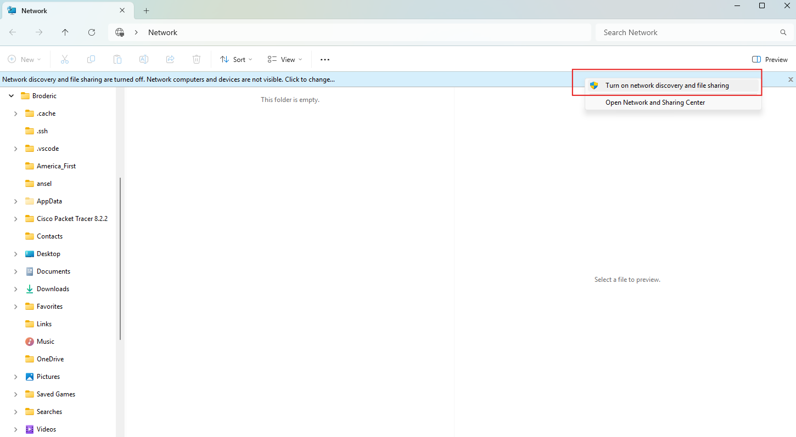

Go back to your command prompt and type in `ipconfig`. Find your corresponding network interface, and make note of the IP next to `IPV4 Address`.

Now ssh into your Pi that is running Nightscout. Run `sudo apt update` then `sudo apt install cifs-utils -y`. Should be already installed, but just in case it's not. 

Next you'll need to create a new directory for this share. I like to put mine in `/mnt`. So next command `sudo mkdir /mnt/nsbackups`. Now it's time to connect to the remote share and test it out.

Run the command: `sudo mount -t cifs //X.X.X.X/NSBackup /mnt/nsbackups -o username=fileshareusername,password=yourpassword`

With the X.X.X.X being your IP of the machine that hosts the file share.

If the command runs with no errors, then you should be good. To 100% confirm head over to the share directory using `cd /mnt/nsbackups`. Then run `sudo touch test.txt`. This should create a text file in the share. Now go back to your Windows device and open up the share, if you see the text file you're all good. Run `sudo rm test.txt` to remove the file. Now unmount the share: `sudo umount /mnt/nsbackups`

Here you are going to permanently mount the share, so if you reboot the device, it'll automatically mount for you. Run `sudo nano /etc/fstab`. Here you can add your mount config. In the file scroll down to the first blank line and add: `//X.X.X.X/NSBackup /mnt/nsbackups cifs username=sharens,password=yourpassword,nofail 0 0`

Now run `sudo systemctl daemon-reload` and then `sudo mount -a`. 

Now it's time to create a copy of your nightscout data from the mongodb docker container and add it to your backup share. Make sure your Nightscout is running. First run: `sudo docker exec mongo mongodump --out /data/backup` then `sudo docker exec mongo tar -czvf $(date +%F).tar.gz /data/backup`. This compresses the file down before moving it over to the network share. Run `sudo docker cp mongo:/$(date +%F).tar.gz /mnt/nsbackups`  Now just run `docker exec mongo rm -rf /data/backup /$(date +%F).tar.gz` to remove the backups from the container. This set of commands creates a backup that is compressed to save space on your network share and then removes it from the container so you aren't carrying two identical backup copies. 

Next step is to automate this process. You'll first need to create a bash script, and then create a cron job to automate the execution of that script. First, ensure you're in your home directory with `cd ~` command. Then download the script with `wget https://raw.githubusercontent.com/have-no-clue-what-im-doing/nightscout_scripts/refs/heads/main/nsbackups.sh`. Then do a `chmod +x nsbackups.sh` so you can execute the script. Now test out the script by executing it: `sudo ./nsbackups.sh`

You should see output like this:

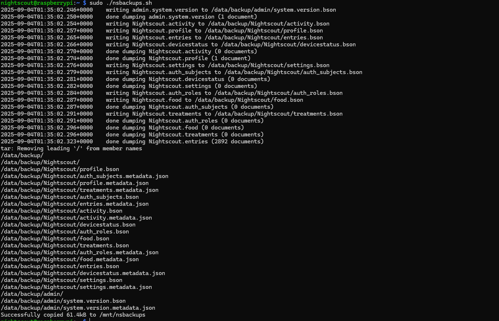

If you don't, check the log file with `cat nsbackups.log`. This should log if there was an error with the mount or one of the containers. Use that log file for any future issues as well. 

If the script runs successfully, you can move on to automating it with a cronjob:

Run the command `sudo crontab -e`. Type in `1` to select `nano` as your preferred text editor. Once in the editor, navigate down to the first blank line and put in: `0 0 * * * sudo /home/nightscout/nsbackups.sh`. This'll run the script daily at exactly 12am. If you want to run it weekly: `0 0 * * SUN sudo /home/nightscout/nsbackups.sh`. If you'd prefer a different schedule, you can visit [this](https://crontab.guru/) site to help with creating the schedule you want.

Make sure to save and exit with a `ctrl + o` then `ctrl + x` once you're done editing the cronjob.

One thing to note is that this script does not do any type of backup / log rotation. That means old logs and backups will have to be manually deleted. This is pretty important as your backups become larger and larger, thus taking up more and more space. This post is already long enough, so I will leave that up for you to add to the script and implement in your own way. (Maybe later I can add a slightly adjustable backup rotation to the script)

#### Restoring an Automated Backup

IMPORTANT: The supplied Docker Compose file uses MongoDB `5.0.32`. Restore a backup only to the same MongoDB major version that created it, or to a version reached through MongoDB's documented upgrade path. Do not restore or reuse a data directory with an older MongoDB version; it can fail immediately or cause data problems later.

Now if you need to restore, ensure your Docker containers (Nightscout & Mongo) are running. You'll start by unzipping the archive that you want to restore. So over in `/mnt/nsbackups` create a new directory: `sudo mkdir /mnt/nsbackups/2025-08-27-restore`. You can name it whatever you want, you'll just need to reference it when doing the restore. Now run (make sure you're in the /mnt/nsbackups directory. Also insert whatever backup date you want to restore from.) `sudo tar -xzvf 2025-08-27.tar.gz -C /mnt/nsbackups/2025-08-28-restore`. This uncompresses the archive, then creates and places it in a folder named `2025-08-28-restore`.

Start with `sudo docker exec mongo mkdir /data/restore`. Then `sudo docker cp /mnt/nsbackups/2025-08-27-restore mongo:/data/restore/`. Replace the file date with whatever file date you want to restore with. Now to restore: `sudo docker exec mongo mongorestore /data/restore/2025-08-27`. Should then tell you if the documents restored successfully or failed to restore.
